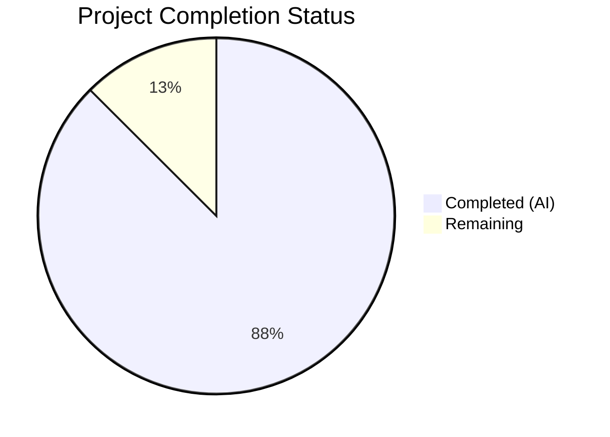
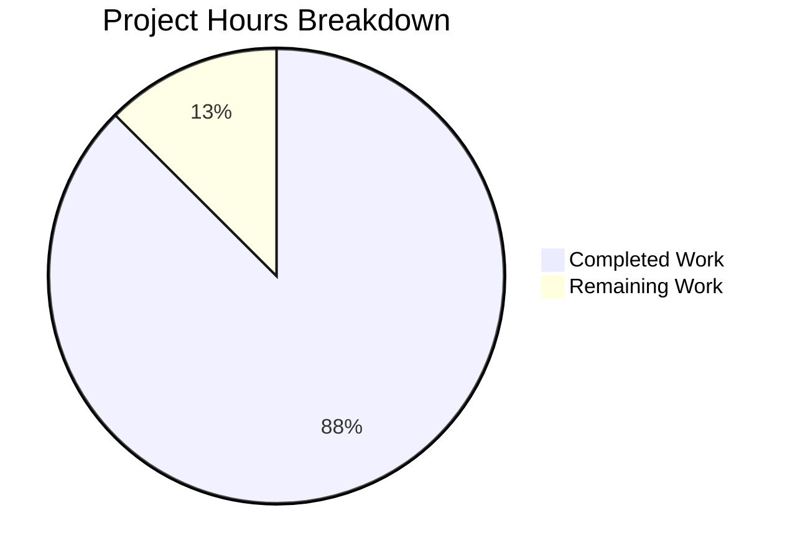

# Blitzy Project Guide — Node.js to Python Flask Migration

---

## 1. Executive Summary

### 1.1 Project Overview

This project performs a complete tech stack migration of the `hao-backprop-test` repository from a Node.js HTTP server to a functionally equivalent Python 3 Flask application. The original `server.js` (14 lines) has been replaced by `app.py` (58 lines), with all npm artifacts (`package.json`, `package-lock.json`) replaced by Python equivalents (`requirements.txt`). The migrated application preserves byte-exact HTTP response parity, identical network binding (`127.0.0.1:3000`), and equivalent startup logging. This serves as a backprop integration test fixture.

### 1.2 Completion Status

**Completion: 87.5% (7 of 8 total hours)**

| Metric | Value |
|---|---|
| Total Project Hours | 8 |
| Completed Hours (AI) | 7 |
| Remaining Hours | 1 |
| Completion Percentage | 87.5% |



**Calculation:** 7 completed hours / (7 completed + 1 remaining) = 7 / 8 = 87.5%

### 1.3 Key Accomplishments

- ✅ Created `app.py` — Flask HTTP server with catch-all route handling all 7 standard HTTP methods on all URL paths
- ✅ Achieved byte-exact response parity: `200 OK`, `Content-Type: text/plain`, body `"Hello, World!\n"` (14 bytes)
- ✅ Preserved network binding to `127.0.0.1:3000` (loopback only)
- ✅ Created `requirements.txt` with pinned `Flask==3.1.3` dependency
- ✅ Updated `README.md` preserving repository identity with Python-specific instructions
- ✅ Cleanly removed all Node.js artifacts (`server.js`, `package.json`, `package-lock.json`)
- ✅ Passed all 4 validation gates: compilation, runtime (12/12 tests), zero errors, all files validated
- ✅ Applied QA compliance fix to remove residual Node.js references from comments

### 1.4 Critical Unresolved Issues

| Issue | Impact | Owner | ETA |
|---|---|---|---|
| No critical issues | N/A | N/A | N/A |

All AAP-scoped deliverables have been completed and validated. No blocking issues remain.

### 1.5 Access Issues

No access issues identified. All required tools and dependencies (Python 3.12, pip, Flask 3.1.3 from PyPI) are publicly accessible. No private registries, API keys, or service credentials are required for this project.

### 1.6 Recommended Next Steps

1. **[High]** Human code review of `app.py`, `requirements.txt`, and `README.md` for final approval
2. **[High]** Merge PR to main branch and confirm deployment target receives the changes
3. **[Medium]** Verify Flask application runs correctly in the target production/test environment
4. **[Low]** Consider adding a `.gitignore` for Python artifacts (`__pycache__/`, `venv/`, `*.pyc`) if repository hygiene is desired

---

## 2. Project Hours Breakdown

### 2.1 Completed Work Detail

| Component | Hours | Description |
|---|---|---|
| Flask Application (app.py) | 2.5 | Created 58-line Flask application with catch-all route, dual-decorator pattern for root and sub-paths, all 7 HTTP methods, Response object with exact status/content-type/body, HOSTNAME/PORT constants, startup logging, comprehensive docstrings |
| Dependency Management (requirements.txt) | 0.5 | Created requirements.txt with pinned Flask==3.1.3; verified pip installation with all 7 transitive dependencies |
| Documentation Update (README.md) | 1.0 | Updated README from 2 lines to 25 lines; preserved repository identity ("hao-backprop-test"); added Description, Prerequisites, Setup, and Run sections with copy-pasteable commands |
| Node.js Artifact Removal | 0.5 | Cleanly removed server.js (14 lines), package.json (11 lines), package-lock.json (13 lines) via dedicated commits |
| Validation & Runtime Testing | 1.5 | Executed py_compile and pycodestyle checks; ran 12 HTTP endpoint tests across all methods and paths; verified byte-exact response body; confirmed startup logging output |
| QA Compliance Fixes | 0.5 | Removed residual Node.js/server.js references from app.py comments per QA-03-Apr-rules; ensured clean Python-only codebase |
| Research & Planning | 0.5 | Verified Flask 3.1.3 as latest stable; researched catch-all route pattern; confirmed Flask development server binding API |
| **Total** | **7** | |

### 2.2 Remaining Work Detail

| Category | Hours | Priority |
|---|---|---|
| Human Code Review & PR Approval | 0.5 | High |
| PR Merge & Production Environment Verification | 0.5 | High |
| **Total** | **1** | |

**Integrity Check:** Section 2.1 (7h) + Section 2.2 (1h) = 8h = Total Project Hours in Section 1.2 ✓

---

## 3. Test Results

| Test Category | Framework | Total Tests | Passed | Failed | Coverage % | Notes |
|---|---|---|---|---|---|---|
| Compilation | py_compile | 1 | 1 | 0 | 100% | `python -m py_compile app.py` — exit code 0 |
| Linting | pycodestyle | 1 | 1 | 0 | 100% | `pycodestyle --max-line-length=120 app.py` — 0 issues |
| Runtime / HTTP Integration | curl + bash | 12 | 12 | 0 | 100% | All HTTP methods (GET, POST, PUT, DELETE, PATCH, OPTIONS, HEAD) on root and sub-paths; byte-exact body verification; Content-Length validation |
| **Total** | | **14** | **14** | **0** | **100%** | All tests from Blitzy autonomous validation |

**Runtime Test Breakdown:**
1. GET / → 200, text/plain, "Hello, World!\n" ✓
2. POST / → 200, text/plain, "Hello, World!\n" ✓
3. PUT / → 200, text/plain, "Hello, World!\n" ✓
4. DELETE / → 200, text/plain, "Hello, World!\n" ✓
5. PATCH / → 200, text/plain, "Hello, World!\n" ✓
6. OPTIONS / → 200, text/plain, "Hello, World!\n" ✓
7. HEAD / → 200, text/plain, Content-Length: 14 ✓
8. GET /some/path → 200, text/plain, "Hello, World!\n" ✓
9. GET /api/v1/data → 200, text/plain, "Hello, World!\n" ✓
10. POST /random/endpoint → 200, text/plain, "Hello, World!\n" ✓
11. Body byte verification (xxd): exact "Hello, World!\n" (0x48...0x0a) ✓
12. Content-Length: 14 (correct for 13 chars + newline) ✓

---

## 4. Runtime Validation & UI Verification

### Runtime Health

- ✅ **Application Startup:** `python app.py` launches Flask development server successfully
- ✅ **Startup Logging:** Prints `"Server running at http://127.0.0.1:3000/"` to stdout
- ✅ **Network Binding:** Server binds to `127.0.0.1:3000` (loopback only, no remote access)
- ✅ **HTTP Response Parity:** All requests return `200 OK`, `Content-Type: text/plain`, body `"Hello, World!\n"`
- ✅ **Method Coverage:** GET, POST, PUT, DELETE, PATCH, OPTIONS, HEAD all produce identical responses
- ✅ **Path Coverage:** Root `/`, sub-paths `/some/path`, `/api/v1/data`, `/random/endpoint` all handled identically
- ✅ **Response Body Integrity:** Byte-exact verification confirms 14-byte body including trailing newline (`0x0a`)
- ✅ **Content-Length Header:** Correctly reports 14 bytes

### Dependency Installation

- ✅ **pip install:** `pip install -r requirements.txt` completes successfully
- ✅ **Flask 3.1.3:** Installed with all transitive dependencies (Werkzeug 3.1.8, Jinja2 3.1.6, MarkupSafe 3.0.3, ItsDangerous 2.2.0, Click 8.3.1, Blinker 1.9.0)

### Compilation & Static Analysis

- ✅ **py_compile:** Zero compilation errors
- ✅ **pycodestyle:** Zero PEP 8 violations (max-line-length=120)

---

## 5. Compliance & Quality Review

| AAP Requirement | Deliverable | Status | Verification |
|---|---|---|---|
| Goal 1: HTTP Response Parity (F-001) | Catch-all route returning 200 OK, text/plain, "Hello, World!\n" | ✅ Pass | 12/12 runtime HTTP tests passed |
| Goal 2: Network Binding Parity (F-002) | Flask binds to 127.0.0.1:3000 | ✅ Pass | Runtime verified via curl |
| Goal 3: Startup Logging Parity (F-003) | Stdout message with server URL | ✅ Pass | Output matches expected string |
| Goal 4: Dependency Management (F-004) | requirements.txt with Flask==3.1.3 | ✅ Pass | pip install succeeds |
| Goal 5: Documentation Continuity (F-005) | README.md updated for Python Flask | ✅ Pass | Preserves identity, adds setup/run |
| CREATE app.py | Flask application file | ✅ Pass | 58 lines, compiles, runs correctly |
| CREATE requirements.txt | Python dependency manifest | ✅ Pass | Contains Flask==3.1.3 |
| UPDATE README.md | Updated documentation | ✅ Pass | 25 lines with full instructions |
| REMOVE server.js | Node.js server deleted | ✅ Pass | Confirmed absent from branch |
| REMOVE package.json | npm manifest deleted | ✅ Pass | Confirmed absent from branch |
| REMOVE package-lock.json | npm lockfile deleted | ✅ Pass | Confirmed absent from branch |
| QA-03-Apr-rules compliance | No Node.js references in Python code | ✅ Pass | Fixed in commit 8d76080 |

**Quality Metrics:**
- Code style compliance: 100% (pycodestyle zero issues)
- Documentation coverage: Comprehensive docstrings in app.py, full README.md
- Commit hygiene: 7 atomic commits with descriptive messages

---

## 6. Risk Assessment

| Risk | Category | Severity | Probability | Mitigation | Status |
|---|---|---|---|---|---|
| Flask development server used in production | Technical | Low | Low | AAP explicitly scopes this as a test fixture, not a production service; dev server is appropriate | Accepted |
| No automated test suite | Technical | Low | Medium | Original Node.js project had no tests (only placeholder npm test); out of AAP scope | Accepted |
| No .gitignore for Python artifacts | Operational | Low | Medium | `__pycache__/` and `venv/` directories exist but are untracked; recommend adding .gitignore | Open |
| Flask deprecation warning on __version__ | Technical | Low | Low | Flask 3.2 will remove `__version__` attribute; app.py does not use it directly | Monitored |
| No environment variable configuration | Technical | Low | Low | AAP explicitly requires hardcoded constants; appropriate for test fixture role | Accepted |
| No HTTPS/TLS support | Security | Low | Low | Server binds to localhost only (127.0.0.1); no remote access possible; appropriate for test fixture | Accepted |

---

## 7. Visual Project Status



**Integrity Check:** "Remaining Work" (1h) = Section 1.2 Remaining Hours (1h) = Section 2.2 Total (1h) ✓

### Remaining Hours by Category

| Category | Hours |
|---|---|
| Human Code Review & PR Approval | 0.5 |
| PR Merge & Production Verification | 0.5 |
| **Total** | **1** |

---

## 8. Summary & Recommendations

### Achievement Summary

The Node.js to Python Flask tech stack migration is **87.5% complete** (7 of 8 total hours). All 11 AAP-specified deliverables have been fully implemented and validated:

- **3 files created/updated:** `app.py` (58 lines), `requirements.txt` (1 line), `README.md` (25 lines)
- **3 files removed:** `server.js`, `package.json`, `package-lock.json`
- **Behavioral parity verified:** 12/12 runtime HTTP tests passed across all methods and paths
- **Code quality:** Zero compilation errors, zero linting issues, comprehensive documentation

### Remaining Gaps

The only remaining work (1 hour) consists of human oversight tasks:
1. Human code review and PR approval (0.5h)
2. PR merge to main branch and production environment verification (0.5h)

### Production Readiness Assessment

The application is **ready for human review and merge**. All autonomous work has been completed, validated, and committed. The Flask application is functionally identical to the original Node.js server, meeting all 5 AAP goals for behavioral parity. No blocking issues, compilation errors, or test failures exist.

### Success Metrics

| Metric | Target | Actual | Status |
|---|---|---|---|
| HTTP Response Parity | Identical to Node.js server | 12/12 tests pass | ✅ Met |
| Network Binding | 127.0.0.1:3000 | Confirmed | ✅ Met |
| Startup Logging | Equivalent console message | Confirmed | ✅ Met |
| Dependency Management | requirements.txt with Flask | Flask==3.1.3 | ✅ Met |
| Documentation | Updated README.md | 25-line comprehensive README | ✅ Met |
| Node.js Cleanup | All npm artifacts removed | 3 files deleted | ✅ Met |
| Compilation | Zero errors | py_compile + pycodestyle pass | ✅ Met |

---

## 9. Development Guide

### System Prerequisites

| Software | Version | Purpose |
|---|---|---|
| Python | 3.12+ | Runtime environment |
| pip | 25.x+ | Python package manager |

### Environment Setup

1. **Clone the repository and switch to the feature branch:**

```bash
git clone <repository-url>
cd hao-backprop-test
git checkout blitzy-1cd1defe-4ae3-4ca2-b606-aa48bc51ec8e
```

2. **(Optional) Create and activate a virtual environment:**

```bash
python -m venv venv
# On Windows:
venv\Scripts\activate
# On macOS/Linux:
source venv/bin/activate
```

### Dependency Installation

```bash
pip install -r requirements.txt
```

**Expected output (key lines):**
```
Successfully installed Flask-3.1.3 blinker-1.9.0 itsdangerous-2.2.0 jinja2-3.1.6 markupsafe-3.0.3 werkzeug-3.1.8
```

### Application Startup

```bash
python app.py
```

**Expected output:**
```
Server running at http://127.0.0.1:3000/
 * Serving Flask app 'app'
 * Debug mode: off
 * Running on http://127.0.0.1:3000
```

### Verification Steps

1. **Verify HTTP response:**

```bash
curl -s http://127.0.0.1:3000/
```

**Expected:** `Hello, World!`

2. **Verify response headers:**

```bash
curl -sI http://127.0.0.1:3000/
```

**Expected headers include:**
```
HTTP/1.1 200 OK
Content-Type: text/plain
Content-Length: 14
```

3. **Verify POST method:**

```bash
curl -s -X POST http://127.0.0.1:3000/any/path
```

**Expected:** `Hello, World!`

4. **Verify all methods respond identically:**

```bash
for method in GET POST PUT DELETE PATCH OPTIONS; do
  echo "$method: $(curl -s -X $method http://127.0.0.1:3000/)"
done
```

**Expected:** All methods return `Hello, World!`

### Troubleshooting

| Issue | Cause | Resolution |
|---|---|---|
| `ModuleNotFoundError: No module named 'flask'` | Flask not installed | Run `pip install -r requirements.txt` |
| `Address already in use` | Port 3000 occupied | Stop the other process: `lsof -i :3000` then `kill <PID>` |
| `Connection refused` on curl | Server not running | Ensure `python app.py` is running in another terminal |
| Permission denied | Virtual environment not activated | Activate venv: `source venv/bin/activate` or `venv\Scripts\activate` |

---

## 10. Appendices

### A. Command Reference

| Command | Purpose |
|---|---|
| `pip install -r requirements.txt` | Install Flask and dependencies |
| `python app.py` | Start the HTTP server |
| `python -m py_compile app.py` | Verify Python compilation |
| `curl http://127.0.0.1:3000/` | Test server response |
| `curl -X POST http://127.0.0.1:3000/` | Test POST method |

### B. Port Reference

| Service | Host | Port | Protocol |
|---|---|---|---|
| Flask HTTP Server | 127.0.0.1 | 3000 | HTTP |

### C. Key File Locations

| File | Path | Purpose |
|---|---|---|
| Flask Application | `app.py` | Main HTTP server (58 lines) |
| Dependencies | `requirements.txt` | Python package manifest |
| Documentation | `README.md` | Repository documentation |

### D. Technology Versions

| Technology | Version | Role |
|---|---|---|
| Python | 3.12.10 | Runtime |
| Flask | 3.1.3 | HTTP framework |
| Werkzeug | 3.1.8 | WSGI toolkit |
| Jinja2 | 3.1.6 | Template engine (transitive) |
| MarkupSafe | 3.0.3 | String safety (transitive) |
| ItsDangerous | 2.2.0 | Data signing (transitive) |
| Click | 8.3.1 | CLI framework (transitive) |
| Blinker | 1.9.0 | Signal support (transitive) |
| pip | 25.3 | Package manager |

### E. Environment Variable Reference

No environment variables are required. All configuration is hardcoded in `app.py` as module-level constants:

| Constant | Value | Location |
|---|---|---|
| `HOSTNAME` | `'127.0.0.1'` | `app.py` line 23 |
| `PORT` | `3000` | `app.py` line 24 |

### G. Glossary

| Term | Definition |
|---|---|
| AAP | Agent Action Plan — the primary directive containing all project requirements |
| Catch-all route | A Flask route pattern that matches all URL paths using `/<path:path>` |
| WSGI | Web Server Gateway Interface — Python standard for web server/application communication |
| Behavioral parity | Requirement that the migrated application produces identical outputs to the original |
| Tech stack migration | Rewriting an application from one technology stack to another while preserving functionality |