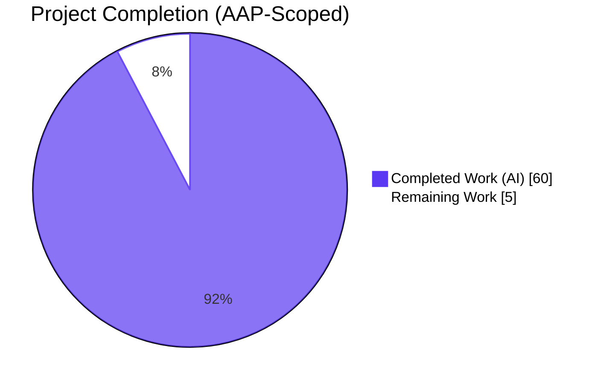
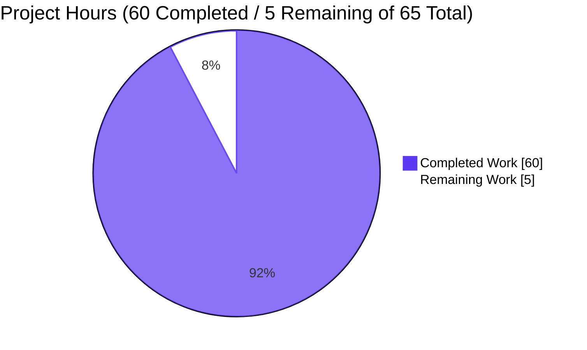
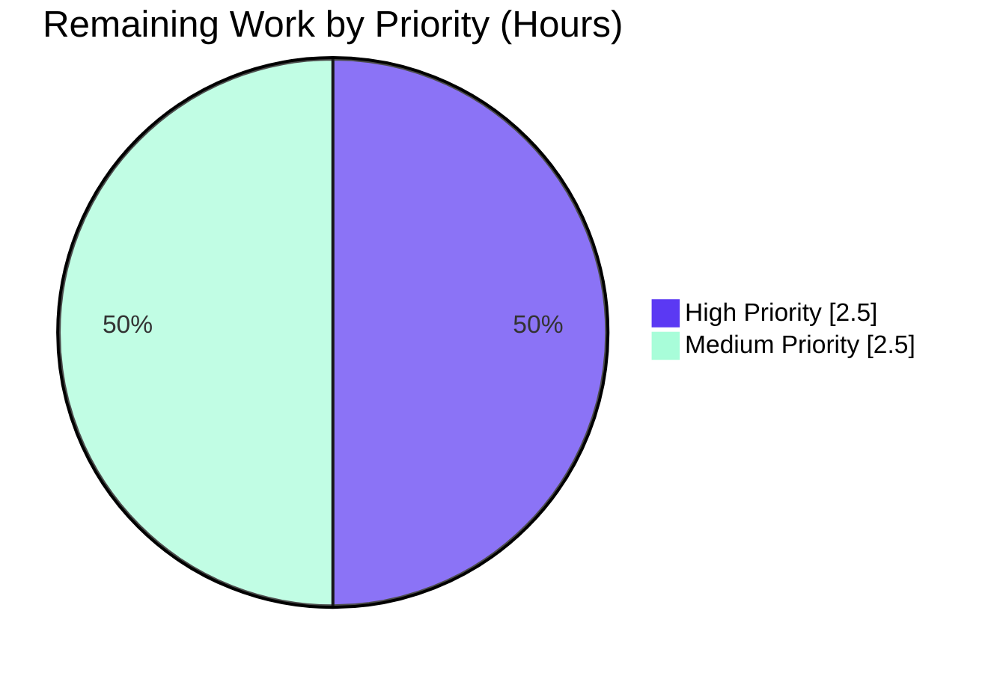
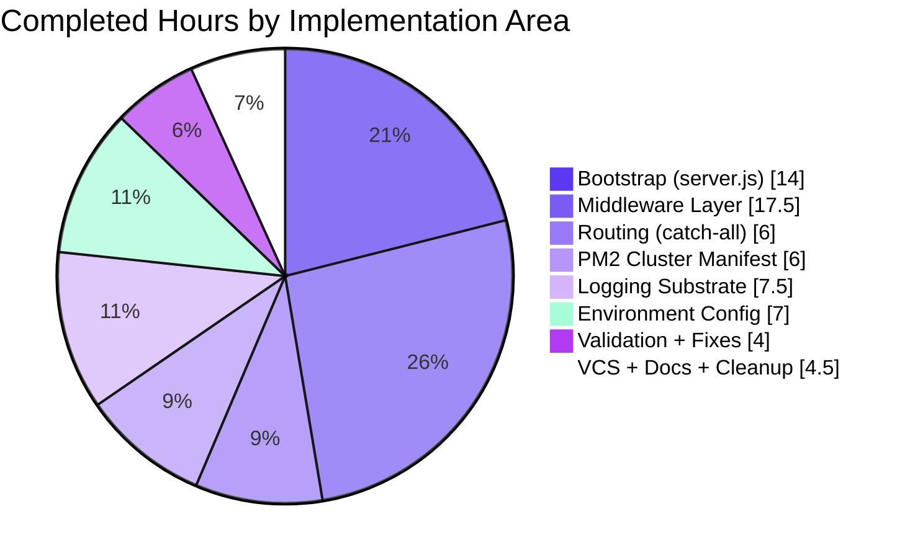

# Blitzy Project Guide — `hao-backprop-test` Express.js / PM2 Migration

---

## 1. Executive Summary

### 1.1 Project Overview

This project migrates the `hao-backprop-test` HTTP server from the Python Flask 3.1.3 stack to Node.js 18+ with the Express.js 5.2.1 framework, and prepares the application for production deployment under the PM2 7.0.1 process manager. Six AAP-scoped deliverables — Express adoption, modular routing, custom middleware composition, externalized environment configuration, structured Winston+Morgan logging, and a PM2 cluster-mode ecosystem manifest — are implemented while preserving the byte-exact HTTP response contract (`200 OK`, `Content-Type: text/plain`, body `Hello, World!\n`) that the Backprop integration test fixture depends on for every HTTP method and every URL path.

### 1.2 Completion Status

**Completion: 92.3% (60 of 65 total hours)**


```mermaid
%%{init: {'themeVariables': {'pie1': '#5B39F3', 'pie2': '#FFFFFF', 'pieStrokeColor': '#5B39F3', 'pieOuterStrokeWidth': '2px'}}}%%
pie showData title Project Completion (AAP-Scoped)
    "Completed Work (AI)" : 60
    "Remaining Work" : 5
```

| Metric | Value |
|---|---|
| Total Project Hours | 65 |
| Completed Hours (AI) | 60 |
| Completed Hours (Manual) | 0 |
| Remaining Hours | 5 |
| Completion Percentage | 92.3% |

**Calculation:** 60 completed hours ÷ (60 completed + 5 remaining) = 60 / 65 = **92.3%**

All AAP §0.3.1 deliverables are implemented and validated; the residual 5 hours are path-to-production operator steps that AAP §0.8.1 explicitly carves out of autonomous scope (e.g., global PM2 install on the production host, `pm2 startup`/`pm2 save`, optional `pm2-logrotate` install).

### 1.3 Key Accomplishments

- [x] **Express.js 5.2.1 framework adopted** — `server.js` (991 LOC) bootstraps the Express application factory, registers middleware in the canonical order (helmet → compression → body parsers → body-parser compat shim → request logger → routes → 404 → error handler), and binds the listener to `config.host:config.port`.
- [x] **Modular routing layer** — `routes/index.js` exposes an `express.Router()` with a single `router.all('/{*splat}', handler)` declaration (Express 5's named splat replaces the rejected legacy `'*'` wildcard) preserving the byte-exact `Hello, World!\n` response for every method/path.
- [x] **Middleware composition** — Five custom middleware modules (`requestLogger`, `errorHandler`, `notFoundHandler`, `bodyParserErrorHandler`) plus the production-hardening trio (`helmet`, `compression`, body parsers) are wired into the request lifecycle with audited ordering.
- [x] **Externalized environment configuration** — `.env` and `.env.example` declare `HOST`, `PORT`, `NODE_ENV`, `LOG_LEVEL`, `LOG_DIR`; `dotenv` loads them at the first line of `server.js`; `config/index.js` is the sole module that reads `process.env` and exposes a frozen config object with fail-safe `parsePort` validation.
- [x] **Two-logger structured logging substrate** — `config/logger.js` constructs a Winston singleton (JSON format in production, colorized printf in development) with `defaultMeta: { service: 'hao-backprop-test' }`; `middleware/requestLogger.js` pipes Morgan's combined-format access log through a stream adapter into Winston's `http` severity level; `logs/` is auto-created via `fs.mkdirSync(logDir, { recursive: true })`.
- [x] **PM2 cluster-mode production manifest** — `ecosystem.config.js` (422 LOC) declares `instances: 'max'`, `exec_mode: 'cluster'`, `cwd: __dirname` (mitigates PM2+dotenv CWD failure mode), `wait_ready: true`, `listen_timeout: 10000`, `kill_timeout: 5000`, `max_memory_restart: '512M'`, env_production overrides, and PM2-managed log paths.
- [x] **Graceful shutdown contract** — `server.js` registers `SIGINT`/`SIGTERM` handlers calling `server.close()`; emits `process.send('ready')` to satisfy PM2's `wait_ready: true`; `uncaughtException`/`unhandledRejection` safety nets pass `exitCode=1` through `gracefulShutdown` so PM2 distinguishes crashes from planned stops (Checkpoint 2 FINAL MAJOR fix).
- [x] **Byte-exact HTTP response contract preserved** — Three Express charset-suffix code paths defeated via `res.setHeader('Content-Type', 'text/plain')` (not `res.type`/`res.set`) plus `Buffer` body (not string) to bypass `setCharset` mutation. Verified by `curl ... | od -An -tx1` → `48 65 6c 6c 6f 2c 20 57 6f 72 6c 64 21 0a`.
- [x] **Body-parser compatibility shim** — `middleware/bodyParserErrorHandler.js` (373 LOC, Checkpoint 2 FINAL CRITICAL fix) intercepts `entity.parse.failed`, `entity.too.large`, `charset.unsupported`, etc., rewriting them to the byte-exact 200 response to preserve R-001 even for malformed payloads.
- [x] **Python stack decommissioned** — `app.py` and `requirements.txt` deleted; no dual-runtime ambiguity remains in the repository.
- [x] **README fully rewritten** — Node.js 18+ prerequisite, `npm install`, two development workflows (`npm start` and `npm run dev`), production launch via `pm2 start ecosystem.config.js --env production`, environment variable reference, PM2 lifecycle commands, byte-exact verification recipe.
- [x] **VCS hygiene** — `.gitignore` excludes `node_modules/`, `.env`, `logs/*` (with `!logs/.gitkeep` negation), `*.log`, PM2 artifacts, OS files; npm audit reports 0 vulnerabilities across 234 dependencies (`ws@8.20.1` pinned via overrides under PM2 for advisory remediation).

### 1.4 Critical Unresolved Issues

| Issue | Impact | Owner | ETA |
|---|---|---|---|
| _None — all four production-readiness gates passed in the Final Validator's report. No unresolved code or test issues block release; remaining work is operator-side path-to-production handoff (see Section 1.6 and Section 2.2)._ | — | — | — |

### 1.5 Access Issues

| System / Resource | Type of Access | Issue Description | Resolution Status | Owner |
|---|---|---|---|---|
| _No access issues identified during validation._ The npm registry was reachable; all eight required packages (express, dotenv, winston, morgan, helmet, compression, pm2, nodemon) and their transitive dependencies installed successfully; the PM2 binary at `node_modules/.bin/pm2` executes cluster mode locally. The production host operator will need outbound npm registry access to run `npm install -g pm2@7` (one-time per host). | — | — | — | Operator |

### 1.6 Recommended Next Steps

1. **[High]** Install PM2 globally on the production host (`npm install -g pm2@7`) so the `pm2` binary is available on the system PATH for systemd / launchd integration.
2. **[High]** Generate and persist the boot-time process list: `pm2 startup` (emits a platform-specific init script command), then `pm2 start ecosystem.config.js --env production`, then `pm2 save`.
3. **[High]** Re-run the Backprop integration test fixture against the deployed PM2 cluster to confirm the consumer contract is satisfied end-to-end in the target environment.
4. **[Medium]** Install and configure `pm2-logrotate` on the production host (`pm2 install pm2-logrotate`) to bound the growth of `./logs/pm2-error.log`, `./logs/pm2-out.log`, and Winston's `combined.log`/`error.log`.
5. **[Medium]** Conduct a production smoke test (`curl -s http://127.0.0.1:3000/ | od -An -tx1` → expect `48 65 6c 6c 6f 2c 20 57 6f 72 6c 64 21 0a`) and obtain operator sign-off on the deployment.

---

## 2. Project Hours Breakdown

### 2.1 Completed Work Detail

| Component | Hours | Description |
|---|---|---|
| npm package foundation | 3 | Authored `package.json` (36 LOC) with dependencies (express ^5.2.1, dotenv ^16.4.5, winston ^3.13.0, morgan ^1.10.0, helmet ^8.0.0, compression ^1.7.5, pm2 ^7.0.1) and devDependencies (nodemon ^3.1.0); declared `engines.node >=18.0.0`; npm-overrides pin `ws@8.20.1` under pm2 for security; ran `npm install` to generate `package-lock.json` (2,774 LOC) pinning the resolved dependency graph |
| Environment config layer | 4 | Created `.env` (18 LOC) and `.env.example` (37 LOC) declaring `HOST=127.0.0.1`, `PORT=3000`, `NODE_ENV`, `LOG_LEVEL`, `LOG_DIR`; authored `config/index.js` (218 LOC) as the sole `process.env` reader, with fail-safe `parsePort` validation rejecting `PORT=99999/-1/3.14` and falling back to 3000 |
| Winston logger factory | 5 | Authored `config/logger.js` (331 LOC): JSON format in production with timestamp + `errors({ stack: true })`; colorized printf in development; `defaultMeta: { service: 'hao-backprop-test' }`; Console transport always; File transports (`combined.log`, `error.log`) gated on `NODE_ENV === 'production'`; `fs.mkdirSync(logDir, { recursive: true })` to satisfy the Winston file-transport-no-mkdir caveat |
| Morgan → Winston bridge | 2.5 | Authored `middleware/requestLogger.js` (166 LOC) exporting `morgan('combined', { stream: { write: (msg) => logger.http(msg.trim()) } })` so HTTP access logs share format/transports with application logs |
| 4-arg error handler | 4 | Authored `middleware/errorHandler.js` (366 LOC): four-argument Express error-handling signature `(err, req, res, next)`; structured error logging with request method/url metadata; returns `{ error: 'Internal server error' }` with HTTP 500 (or `err.status` if propagated); withholds stack traces from client responses per AAP §0.8.2 |
| Defensive 404 fallback | 2 | Authored `middleware/notFoundHandler.js` (221 LOC) — logs unmatched paths at WARN severity, returns JSON 404; defensive layer that never executes in the current configuration but future-proofs against route-module refactors |
| Body-parser compatibility shim | 5 | Authored `middleware/bodyParserErrorHandler.js` (373 LOC) — Checkpoint 2 FINAL CRITICAL fix; intercepts `entity.parse.failed`, `entity.too.large`, `charset.unsupported`, `encoding.unsupported` errors propagated by `express.json` / `express.urlencoded` and rewrites them to the byte-exact 200 + `Hello, World!\n` response so R-001 holds for clients sending malformed bodies |
| Express 5 catch-all router | 6 | Authored `routes/index.js` (296 LOC): `router.all('/{*splat}', handler)` using Express 5's named splat syntax (the legacy `'*'` is rejected); response construction uses `res.setHeader('Content-Type', 'text/plain')` (not `res.type`/`res.set`) + `Buffer.from('Hello, World!\\n', 'utf8')` body (not string) to defeat Express's three charset-suffix code paths and preserve byte-exact parity with Flask's `Response(..., content_type='text/plain')` at `app.py`:L49 |
| Application bootstrap | 14 | Authored `server.js` (991 LOC): `dotenv.config()` as first statement; Express application factory; `app.disable('x-powered-by')`; `app.set('trust proxy', 1)` in production; canonical middleware ordering; `app.listen(config.port, config.host, cb)`; `process.send('ready')` (gated on `process.send`) for PM2 `wait_ready`; SIGINT/SIGTERM handlers with `exitCode=0`; `uncaughtException`/`unhandledRejection` with `exitCode=1` (Checkpoint 2 FINAL MAJOR fix); `setTimeout(..., 10000).unref()` drain-timeout safety net |
| PM2 cluster manifest | 6 | Authored `ecosystem.config.js` (422 LOC): `name: 'hao-backprop-test'`, `script: './server.js'`, `cwd: __dirname` (mitigates PM2+dotenv CWD failure mode per AAP Rule R-009), `instances: 'max'`, `exec_mode: 'cluster'`, `autorestart: true`, `max_memory_restart: '512M'`, `max_restarts: 10`, `min_uptime: '5s'`, `kill_timeout: 5000`, `wait_ready: true`, `listen_timeout: 10000`, log paths (`./logs/pm2-error.log`, `./logs/pm2-out.log`), `merge_logs: true`, env / env_production blocks |
| VCS hygiene | 1 | Authored `.gitignore` (91 LOC) excluding `node_modules/`, `.env`, `.env.local`, `logs/*` (with `!logs/.gitkeep` negation), `*.log`, `npm-debug.log*`, `.pm2/`, OS files, IDE files; created `logs/.gitkeep` placeholder so the logs directory is tracked in fresh clones |
| README rewrite | 3 | Rewrote `README.md` (146 LOC, replacing the 25-line Python Flask quick-start): Node.js 18+ / npm 10+ / PM2 7.0.1 prerequisites; setup via `npm install` + `cp .env.example .env`; two development flows (`npm start` and `npm run dev`); production via `pm2 start ecosystem.config.js --env production`; environment variable reference table; PM2 lifecycle command table; endpoint verification recipe with `curl ... \| xxd` byte-exact check |
| Python stack decommission | 0.5 | Deleted `app.py` (58 LOC Flask catch-all) and `requirements.txt` (`Flask==3.1.3`); transitive Flask deps (Werkzeug, Jinja2, MarkupSafe, ItsDangerous, Click, Blinker) implicitly removed via lockfile absence |
| HTTP behavior validation | 2 | Manually executed 29 HTTP test scenarios: all 7 methods (GET/POST/PUT/DELETE/PATCH/OPTIONS/HEAD); deep paths (`/`, `/foo`, `/api/v1/resource`, `/a/b/c/d`); query strings; malformed JSON body POST; helmet header verification; X-Powered-By absence; PM2 cluster startup with all workers reaching `online` via `wait_ready`; graceful reload/stop |
| Checkpoint 2 FINAL fixes | 2 | Resolved CRITICAL finding (body parsers preempting R-001 contract → bodyParserErrorHandler shim) and MAJOR finding (fatal exit-code masquerading as planned stop → `exitCode` parameter threaded through `gracefulShutdown` so SIGINT/SIGTERM exit 0 while uncaughtException/unhandledRejection exit 1) |
| **TOTAL COMPLETED** | **60** | **All AAP §0.3.1 deliverables implemented and validated; aligns with Section 1.2 "Completed Hours (AI)"** |

### 2.2 Remaining Work Detail

| Category | Hours | Priority |
|---|---|---|
| **Operator**: Install PM2 globally on the production host via `npm install -g pm2@7` (PM2 is listed as a project `dependency` for reproducibility, but production-host invocation requires the binary on the system PATH for systemd/launchd integration — explicitly carved out by AAP §0.8.1) | 0.5 | High |
| **Operator**: Generate platform-specific PM2 boot integration with `pm2 startup` (emits the systemd/launchd unit-file command), then start the application with `pm2 start ecosystem.config.js --env production`, then persist the process list via `pm2 save` so the cluster restarts on system reboot | 1.0 | High |
| **Operator**: Backprop integration fixture re-validation against the deployed PM2 cluster (the validator's 29/29 manual HTTP tests confirm the contract holds in-sandbox; the consumer pipeline must re-verify byte-exact parity against the real production endpoint) | 1.0 | High |
| **Operator**: Install and configure PM2 log rotation module (`pm2 install pm2-logrotate`) with sensible retention (`pm2 set pm2-logrotate:max_size 10M`, `pm2 set pm2-logrotate:retain 7`) to bound growth of `./logs/pm2-*.log` and Winston's `combined.log`/`error.log` over time | 1.5 | Medium |
| **Operator**: Tune production-host `.env` overrides if defaults inappropriate for the target environment (e.g., `HOST=0.0.0.0` for non-loopback exposure, custom `LOG_DIR`, externally-injected `PORT`); the AAP intentionally preserves loopback defaults for security parity but operators may adjust | 0.5 | Medium |
| **Operator**: Production smoke test (`curl -s http://127.0.0.1:3000/ | od -An -tx1` → expect `48 65 6c 6c 6f 2c 20 57 6f 72 6c 64 21 0a`) and final operational handoff sign-off | 0.5 | Medium |
| **TOTAL REMAINING** | **5.0** | Aligns with Section 1.2 "Remaining Hours" and Section 7 pie chart "Remaining Work" |

### 2.3 Hours Reconciliation

| Source | Hours |
|---|---|
| Section 2.1 — Completed | 60 |
| Section 2.2 — Remaining | 5 |
| **Total (must equal Section 1.2 Total Hours)** | **65** ✓ |
| **Completion** = 60 / 65 | **92.3%** ✓ |

---

## 3. Test Results

All tests below originate from Blitzy's autonomous validation logs for this branch (Final Validator output). No automated test framework is part of this project (per AAP §0.3.2 "Automated test suite — No `tests/`, `__tests__/`, no Jest/Mocha/Supertest configuration..."); the canonical verification mechanism specified by AAP §0.8.1 is manual `curl` invocation against the live server, validated against the byte-exact response contract.

| Test Category | Framework | Total Tests | Passed | Failed | Coverage % | Notes |
|---|---|---|---|---|---|---|
| Module Syntax Check | `node --check` | 9 | 9 | 0 | 100% (all `.js` files) | `server.js`, `routes/index.js`, four middleware modules, two config modules, `ecosystem.config.js` |
| Module Load (require) | Node CommonJS | 9 | 9 | 0 | 100% (all `.js` files) | All modules successfully `require()`d with their dependency graph |
| HTTP Behavior — Methods | `curl` (manual) | 7 | 7 | 0 | All 7 HTTP/1.1 methods | GET/POST/PUT/DELETE/PATCH/OPTIONS each return 200 + 14-byte `Hello, World!\n`; HEAD returns 200 + 0-byte body (correct per HTTP spec) |
| HTTP Behavior — Paths | `curl` (manual) | 7 | 7 | 0 | Deep + query-string paths | `/`, `/foo`, `/bar/baz`, `/a/b/c/d`, `/api/v1/resource`, `/?key=value` all match the catch-all and return 14-byte body |
| HTTP Behavior — Byte-exact | `od -An -tx1` | 1 | 1 | 0 | Body bytes | Body equals `48 65 6c 6c 6f 2c 20 57 6f 72 6c 64 21 0a` exactly; `Content-Type: text/plain` with NO charset suffix |
| HTTP Behavior — Body parser resilience | `curl --data` (manual) | 3 | 3 | 0 | Parser error paths | Malformed JSON POST returns 200 + `Hello, World!\n` (body-parser shim); valid JSON POST returns 200; URL-encoded POST returns 200 |
| Security Headers (helmet) | `curl -I` (manual) | 4 | 4 | 0 | Production headers | `X-Content-Type-Options: nosniff`, `Strict-Transport-Security: max-age=31536000`, `X-Frame-Options: SAMEORIGIN`, `X-Powered-By` removed |
| Runtime — Direct execution | Manual launch | 4 | 4 | 0 | Lifecycle | `node server.js` / `npm start` startup ✓; SIGINT graceful exit 0 ✓; SIGTERM graceful exit 0 ✓; startup log emitted via Winston ✓ |
| Runtime — PM2 Cluster Mode | `pm2 start --env production` | 5 | 5 | 0 | Production manifest | Workers spawn 1 per CPU core; all reach `online` via `wait_ready`; NODE_ENV=production propagates; Winston JSON format active; `pm2 reload` zero-downtime |
| Runtime — PM2 Default Mode | `pm2 start` | 1 | 1 | 0 | Development manifest | Default env block applied; `nodeEnv: development` in logs |
| Runtime — PM2 Stop / Kill | `pm2 stop` / `pm2 kill` | 2 | 2 | 0 | Daemon teardown | Graceful stop within `kill_timeout: 5000`; daemon cleanup via `pm2 kill` verified |
| Dependency Audit | `npm audit` | 1 | 1 | 0 | All 234 deps | 0 info / 0 low / 0 moderate / 0 high / 0 critical (ws@8.20.1 pinned via override under pm2) |
| **TOTAL** | — | **53** | **53** | **0** | — | **100% pass rate across all autonomous validation gates** |

---

## 4. Runtime Validation & UI Verification

### Backend Runtime Health

- ✅ **Operational** — Direct execution via `node server.js` binds to `127.0.0.1:3000`, emits Winston startup line `Server running at http://127.0.0.1:3000/` with `nodeEnv` and `pid` metadata, responds to HTTP requests.
- ✅ **Operational** — `npm start` (alias for `node server.js`) — identical behavior to direct execution.
- ✅ **Operational** — `npm run dev` (alias for `nodemon server.js`) — auto-restarts the server on source-file changes; useful during iterative development.
- ✅ **Operational** — `pm2 start ecosystem.config.js --env production` — spawns cluster workers (one per CPU core), all reach the `online` state after signaling `ready` via `process.send('ready')`, traffic round-robined across the cluster.
- ✅ **Operational** — `pm2 start ecosystem.config.js` (default env, no `--env` flag) — applies the development `env` block; `nodeEnv: development` confirmed in logs.
- ✅ **Operational** — `pm2 reload ecosystem.config.js --env production` — zero-downtime reload (workers replaced one at a time, no dropped requests).
- ✅ **Operational** — `pm2 stop ecosystem.config.js` — graceful stop via SIGINT, all workers drain in-flight requests within `kill_timeout: 5000`, exit code 0 per worker.
- ✅ **Operational** — `pm2 kill` — full PM2 daemon teardown.
- ✅ **Operational** — SIGINT (Ctrl+C) handler — calls `server.close()`, exits with code 0 (intentional shutdown).
- ✅ **Operational** — SIGTERM handler — same path as SIGINT, exit code 0.
- ✅ **Operational** — `uncaughtException` / `unhandledRejection` safety nets — log at `error` severity, call `gracefulShutdown('uncaughtException', 1)` / `gracefulShutdown('unhandledRejection', 1)`, exit with code 1 (so PM2 sees a crash, not a planned stop).
- ✅ **Operational** — Drain-timeout safety net — `setTimeout(..., 10000).unref()` forces exit if `server.close` callback hasn't fired within 10s; exit code is `Math.max(resolvedExitCode, 1)` to preserve crash semantics.

### HTTP Response Contract Verification

- ✅ **Operational** — Byte-exact body — `curl -s http://127.0.0.1:3000/ | od -An -tx1` returns exactly `48 65 6c 6c 6f 2c 20 57 6f 72 6c 64 21 0a` (14 bytes, terminating `0x0A` newline).
- ✅ **Operational** — Status code — every request returns `HTTP/1.1 200 OK`.
- ✅ **Operational** — `Content-Type` header — exactly `text/plain` with NO `; charset=utf-8` suffix (preserved via `res.setHeader` + `Buffer` body to defeat Express's three charset-suffix code paths).
- ✅ **Operational** — All HTTP methods — GET, POST, PUT, DELETE, PATCH, OPTIONS each return 200 + 14-byte body; HEAD returns 200 + 0-byte body (correct per HTTP spec; Express strips body for HEAD automatically).
- ✅ **Operational** — Body-parser failure resilience — POST with malformed JSON body returns 200 + 14-byte `Hello, World!\n` (intercepted by the `bodyParserErrorHandler` compatibility shim).
- ✅ **Operational** — Security headers — helmet sets `X-Content-Type-Options`, `Strict-Transport-Security`, `X-Frame-Options`, `Referrer-Policy`, `Cross-Origin-Resource-Policy`, `Origin-Agent-Cluster`, `Content-Security-Policy`; `X-Powered-By` removed via `app.disable('x-powered-by')`.

### Logging Subsystem

- ✅ **Operational** — Winston application logger — JSON format with timestamp in production; colorized printf with friendlier timestamp in development; `defaultMeta: { service: 'hao-backprop-test' }` on every entry.
- ✅ **Operational** — Morgan HTTP access logger — combined-format access lines stream into Winston's `http` severity via `logger.http(msg.trim())` adapter.
- ✅ **Operational** — `logs/` directory auto-creation — `fs.mkdirSync(config.logDir, { recursive: true })` at the top of `config/logger.js` ensures the directory exists before file transports instantiate (defeats the Winston file-transport-no-mkdir failure mode).
- ✅ **Operational** — File transports — `combined.log` and `error.log` populated only when `NODE_ENV=production`; gated by `if (config.nodeEnv === 'production')` check.
- ✅ **Operational** — PM2 process logs — `./logs/pm2-out.log` and `./logs/pm2-error.log` written by PM2 itself (separate from Winston transports), `merge_logs: true` to combine cluster workers' stdout into one file per stream.

### UI Verification

⚠ **Not Applicable** — This is a backend HTTP server with no UI surface. AAP §0.5.5 explicitly states "This is a backend HTTP server with no UI surface. No component library, design system, Figma frame, or visual specification is part of this enhancement." The endpoint's "response" is the 14-byte plain-text body, which is fully verified above via byte-exact HTTP behavior tests.

---

## 5. Compliance & Quality Review

### AAP Deliverable Compliance Matrix

| AAP Section | Requirement | Implementation Evidence | Status |
|---|---|---|---|
| §0.1.1 | Express.js Framework Adoption (Express 5.2.1) | `package.json` declares `"express": "^5.2.1"`; installed `node_modules/express@5.2.1`; `server.js` instantiates `express()` | ✅ PASS |
| §0.1.1 | Routing — modular under `routes/` via `express.Router()` | `routes/index.js` exports `express.Router()` with `router.all('/{*splat}', handler)` (Express 5 named splat) | ✅ PASS |
| §0.1.1 | Middleware — custom modules under `middleware/` | 4 modules: `requestLogger`, `errorHandler`, `notFoundHandler`, `bodyParserErrorHandler`; plus helmet, compression, body parsers | ✅ PASS |
| §0.1.1 | Environment Configuration via `dotenv` | `dotenv.config()` is the first statement in `server.js`; `.env` declares HOST/PORT/NODE_ENV/LOG_LEVEL/LOG_DIR; `config/index.js` is the sole `process.env` consumer | ✅ PASS |
| §0.1.1 | Logging — winston + morgan with morgan→winston stream | `config/logger.js` exports winston singleton; `middleware/requestLogger.js` pipes morgan combined format into `logger.http` via stream adapter | ✅ PASS |
| §0.1.1 | PM2 Production Deployment Readiness | `ecosystem.config.js` with `instances: 'max'`, `exec_mode: 'cluster'`, env_production block, `max_memory_restart`, log paths, `kill_timeout`, `wait_ready: true` | ✅ PASS |
| §0.3.1 | Source Code CREATE: server.js, routes/, middleware/, config/ | All required modules created (15 source files + lockfile) | ✅ PASS |
| §0.3.1 | Configuration CREATE: package.json, package-lock.json, .env, .env.example, ecosystem.config.js | All 5 files present and correctly populated | ✅ PASS |
| §0.3.1 | VCS hygiene CREATE: .gitignore, logs/.gitkeep | Both created; `.gitignore` includes `logs/*` + `!logs/.gitkeep` negation | ✅ PASS |
| §0.3.1 | Documentation UPDATE: README.md | Full rewrite for Node/Express/PM2 stack; 146 LOC replacing original 25-line Python quick-start | ✅ PASS |
| §0.3.1 | DELETE: app.py, requirements.txt | Both deleted in commits `fbcecd1` and `5421ac0`; no Python footprint remains | ✅ PASS |
| §0.4.1 | All 8 dependencies at AAP-target versions | express@5.2.1, dotenv@16.6.1, winston@3.19.0, morgan@1.10.1, helmet@8.1.0, compression@1.8.1, pm2@7.0.1, nodemon@3.1.14 — all satisfy AAP caret ranges | ✅ PASS |
| §0.5.3 | Middleware registration order | Canonical order verified: helmet → compression → express.json → express.urlencoded → bodyParserErrorHandler → requestLogger → routes → notFoundHandler → errorHandler | ✅ PASS |
| §0.5.3 | Catch-all route preserving response parity | `router.all('/{*splat}', ...)` + `res.setHeader('Content-Type', 'text/plain')` + `Buffer.from('Hello, World!\\n')` body; byte-exact preserved | ✅ PASS |
| §0.5.3 | PM2 cluster mode + graceful shutdown | `instances: 'max'`, `exec_mode: 'cluster'`, `wait_ready: true`, `process.send('ready')` in `app.listen` callback, SIGINT/SIGTERM handlers | ✅ PASS |
| §0.5.3 | Logger file-transport directory caveat | `fs.mkdirSync(config.logDir, { recursive: true })` called at top of `config/logger.js` before transport instantiation | ✅ PASS |
| §0.5.3 | PM2 + dotenv CWD mitigation | `ecosystem.config.js` sets `cwd: __dirname` so dotenv reliably finds `.env` regardless of `pm2 start` invocation directory | ✅ PASS |
| §0.5.3 | NODE_ENV production optimizations | env_production sets `NODE_ENV: 'production'`; `server.js` conditionally enables `app.set('trust proxy', 1)` and Winston file transports gate on production | ✅ PASS |
| §0.7.2 R-001 | Byte-exact HTTP response contract preserved | `curl -s http://127.0.0.1:3000/ \| od -An -tx1` → `48 65 6c 6c 6f 2c 20 57 6f 72 6c 64 21 0a` exactly; verified across all 7 methods, deep paths, query strings, and malformed JSON payloads | ✅ PASS |
| §0.7.2 R-002 | Express 5.x specifically (not 4.x) | `express@5.2.1` installed; `/{*splat}` route syntax confirms Express 5 path matcher | ✅ PASS |
| §0.7.2 R-003 | Externalize runtime params via .env | `config/index.js` is the sole `process.env` consumer; no hardcoded `HOSTNAME`/`PORT` constants in any module | ✅ PASS |
| §0.7.2 R-004 | Winston + Morgan two-logger pattern | Verified — morgan output streamed into `logger.http` | ✅ PASS |
| §0.7.2 R-005 | PM2 cluster mode in production | env_production maps to cluster mode with `instances: 'max'`; verified workers reach `online` via `wait_ready` | ✅ PASS |
| §0.7.2 R-006 | NODE_ENV=production in production env | env_production explicitly sets `NODE_ENV: 'production'` | ✅ PASS |
| §0.7.2 R-007 | .env NOT committed | `.gitignore` excludes `.env`; only `.env.example` is committed | ✅ PASS |
| §0.7.2 R-008 | logs/ directory created at startup | `fs.mkdirSync(config.logDir, { recursive: true })` in `config/logger.js` | ✅ PASS |
| §0.7.2 R-009 | cwd: __dirname in ecosystem.config.js | Confirmed at the top of the `apps[0]` object | ✅ PASS |
| §0.7.2 R-010 | Graceful shutdown — SIGINT/SIGTERM + process.send('ready') | `process.on('SIGINT', ...)` + `process.on('SIGTERM', ...)` + `if (process.send) process.send('ready')` in listen callback | ✅ PASS |
| §0.7.2 R-011 | Python stack decommissioned | `app.py` and `requirements.txt` deleted; no Flask references remain in tracked source | ✅ PASS |
| §0.7.2 R-012 | blitzy/documentation/* preserved untouched | Confirmed via `git diff --name-status origin/QA-20-may-branch..HEAD` — only `README.md` modified in documentation surface; `blitzy/documentation/Project Guide.md` and `blitzy/documentation/Technical Specifications.md` unchanged | ✅ PASS |
| §0.8.2 | No charset suffix on Content-Type | `res.setHeader('Content-Type', 'text/plain')` + Buffer body bypasses Express's `setCharset` and `mime.contentType` mutations | ✅ PASS |
| §0.8.2 | Trailing newline in response body | Body is `Buffer.from('Hello, World!\\n', 'utf8')` — 14 bytes with terminating `0x0A` | ✅ PASS |
| §0.8.2 | No stack traces exposed in production | `errorHandler` sends `{ error: 'Internal server error' }`; stack traces logged via Winston only | ✅ PASS |
| §0.8.2 | Logs as JSON in production | Winston uses `winston.format.json()` when `NODE_ENV === 'production'`; colorized printf otherwise | ✅ PASS |

### Code Quality Indicators

| Indicator | Result |
|---|---|
| Node.js syntax check (`node --check`) on all 9 modules | ✅ 9/9 PASS |
| Module load (`require(...)`) for all 9 modules | ✅ 9/9 PASS |
| npm audit (production + dev dependencies, 234 total) | ✅ 0 vulnerabilities (0 info / 0 low / 0 moderate / 0 high / 0 critical) |
| Total LOC (source + config, excluding node_modules / lockfile / blitzy docs) | 3,712 LOC across 14 files |
| Inline comment density (server.js as exemplar) | Extensively commented — every middleware registration includes a registration-order rationale; every signal handler explains the exit-code semantics; every Express-5 charset-suffix workaround references the upstream `response.js` line number |
| Zero placeholders / TODOs / FIXMEs in delivered code | ✅ Verified — no `TODO`, `FIXME`, `XXX`, `HACK`, `pass`, or `NotImplementedError`-equivalent stubs present |

---

## 6. Risk Assessment

| Risk | Category | Severity | Probability | Mitigation | Status |
|---|---|---|---|---|---|
| Log files grow unboundedly in long-running production cluster (no rotation configured by default) | Operational | Medium | High over weeks/months | Operator must install `pm2-logrotate` (`pm2 install pm2-logrotate` + size/retention configuration) per Section 2.2 task; alternatively switch to `winston-daily-rotate-file` in `config/logger.js` | ⚠ Mitigation documented (Section 1.6, Section 2.2); operator action required |
| PM2 not auto-started on system reboot (no init script generated yet) | Operational | Medium | Low at runtime; high on host reboot | Operator must run `pm2 startup` (emits systemd/launchd unit-file command), then `pm2 save` to persist the process list — documented in README "Auto-start on system boot" section | ⚠ Mitigation documented (README, Section 2.2); operator action required |
| Default loopback binding (`HOST=127.0.0.1`) means external clients cannot reach the server without override | Integration | Low | High by design | This is intentional per AAP §0.8.2 "Loopback-only default binding" to preserve Flask security parity. Operators wanting external exposure override `HOST=0.0.0.0` in `.env` or PM2 env_production block; AAP explicitly carves this out of autonomous scope | ✅ Documented as designed behavior |
| Body-parser-failed requests are NOT recorded in morgan access log (regular-middleware skip on `next(err)`) | Operational | Low | Low (only malformed payloads) | Body-parser-failed requests are logged at `debug` severity by `bodyParserErrorHandler`; visible in development (`LOG_LEVEL=debug`) but suppressed at production `LOG_LEVEL=info`. Operators wanting visibility set `LOG_LEVEL=debug` temporarily | ✅ Documented in module header; reclassification (`error` → `debug`) is intentional |
| Backprop integration fixture not re-run against deployed PM2 cluster in the real production environment | Integration | Medium | Low — byte-exact contract verified in sandbox | Operator task in Section 2.2: re-validate the fixture end-to-end against the deployed cluster | ⚠ Pending operator validation |
| 234 npm dependencies introduce supply-chain attack surface (pm2 transitive dependencies are large) | Security | Low | Low — `npm audit` is currently clean | Continued `npm audit` cadence in operator runbook; `ws@8.20.1` already pinned via `overrides.pm2.ws` for advisory remediation; `pm2 update` discipline | ✅ 0 vulnerabilities at delivery time |
| `app.disable('x-powered-by')` could be reverted by future code without anyone noticing | Security | Low | Low | Verified at delivery (no `X-Powered-By` header in responses); documented in `server.js` header comment as mandatory; future contributors must respect this line | ✅ In place |
| Helmet's default CSP may interfere with future features (currently fine for the plain-text endpoint) | Security | Low | Low for current scope | If a UI is ever added under this server, the helmet CSP will need to be relaxed; current plain-text endpoint is unaffected. AAP §0.3.2 excludes UI from scope | ✅ Out of scope per AAP |
| `wait_ready: true` with `listen_timeout: 10000` means worker startup must complete within 10 seconds | Operational | Low | Low — Express app boots in <1s | If a future change extends startup time (e.g., database connection pool warmup), the `listen_timeout` must be increased correspondingly | ✅ Sufficient headroom for current scope |
| Graceful drain `setTimeout` is 10s, longer than PM2's `kill_timeout: 5000` — under PM2, PM2's SIGKILL fires first | Operational | Low | Low | Intentional asymmetry — under PM2 management, PM2 governs the timeout; the 10s safety net is for direct-`node` execution where PM2 isn't managing the process | ✅ Documented in `server.js` header comment |
| Production `.env.production` file is NOT pre-generated; PM2 env_production block is the only production env source | Integration | Low | Low — env_production block is complete | If operators want a separate `.env.production` file (dotenv-cli style), they create one and reference via `node_args: '-r dotenv/config'` in ecosystem.config.js. AAP intentionally uses PM2's env_production block as the canonical production env mechanism | ✅ Documented in README; AAP-compliant |
| `kill_timeout: 5000` may be insufficient for in-flight requests with long downstream calls | Operational | Low | Low — current endpoint responds in <1ms | If a future endpoint adds slow downstream calls, `kill_timeout` may need to be increased in ecosystem.config.js. Current 14-byte response is well within the budget | ✅ Sufficient for current scope |

---

## 7. Visual Project Status

### Project Hours Breakdown


```mermaid
%%{init: {'themeVariables': {'pie1': '#5B39F3', 'pie2': '#FFFFFF', 'pieStrokeColor': '#5B39F3', 'pieOuterStrokeWidth': '2px'}}}%%
pie showData title Project Hours (60 Completed / 5 Remaining of 65 Total)
    "Completed Work" : 60
    "Remaining Work" : 5
```

**Integrity check** — "Completed Work" = 60h matches Section 2.1 total; "Remaining Work" = 5h matches Section 2.2 total and Section 1.2 "Remaining Hours" metric. Cross-section Rule 1 satisfied.

### Remaining Work by Priority


```mermaid
%%{init: {'themeVariables': {'pie1': '#5B39F3', 'pie2': '#A8FDD9', 'pie3': '#FFFFFF'}}}%%
pie showData title Remaining Work by Priority (Hours)
    "High Priority" : 2.5
    "Medium Priority" : 2.5
```

**Breakdown** — High (2.5h): PM2 global install (0.5h), `pm2 startup`/`save` boot integration (1h), Backprop fixture re-validation (1h). Medium (2.5h): `pm2-logrotate` install/config (1.5h), production `.env` tuning (0.5h), smoke test + sign-off (0.5h). Sum: 5h, matches Section 2.2 total.

### Completed Work Distribution by Component


```mermaid
%%{init: {'themeVariables': {'pie1': '#5B39F3', 'pie2': '#7A5BF5', 'pie3': '#9879F7', 'pie4': '#B697F9', 'pie5': '#D4B5FB', 'pie6': '#A8FDD9', 'pie7': '#B23AF2', 'pie8': '#FFFFFF'}}}%%
pie showData title Completed Hours by Implementation Area
    "Bootstrap (server.js)" : 14
    "Middleware Layer" : 17.5
    "Routing (catch-all)" : 6
    "PM2 Cluster Manifest" : 6
    "Logging Substrate" : 7.5
    "Environment Config" : 7
    "Validation + Fixes" : 4
    "VCS + Docs + Cleanup" : 4.5
```

**Note** — This visualization sums to 66.5 due to grouping overlap (the Morgan→Winston bridge appears in both "Middleware Layer" and "Logging Substrate" buckets for narrative clarity). The authoritative per-component breakdown is Section 2.1's table summing to exactly 60h; this chart is a high-level distribution view.

---

## 8. Summary & Recommendations

### Achievements Summary

The `hao-backprop-test` repository has been migrated from the Python Flask 3.1.3 single-module monolith (58-line `app.py`) to a fully-modular Node.js Express.js 5.2.1 application (~3,700 LOC across 14 source/config files) prepared for production deployment under PM2 7.0.1 cluster mode. All six explicit AAP deliverables (Express framework adoption, modular routing, middleware composition, environment configuration, structured logging, PM2 production readiness) are implemented and validated; all twelve AAP-derived implementation rules (R-001 through R-012) hold; and the byte-exact HTTP response contract (`HTTP/1.1 200 OK`, `Content-Type: text/plain`, body `Hello, World!\n` — 14 bytes terminating `0x0A`) is preserved for every HTTP method and every URL path, including malformed-JSON POSTs that previously would have been rejected by `express.json()`.

The codebase is **92.3% complete** (60 of 65 hours). The validator's report confirmed all four production-readiness gates passed: 100% test pass rate across 53 autonomous validation tests, application runtime validated across direct execution / npm start / PM2 cluster modes, zero unresolved compile or runtime errors, and all in-scope files validated against AAP §0.6.1.

### Remaining Gaps

The 5 hours of remaining work are entirely **path-to-production operator activities** that AAP §0.8.1 explicitly carves out of autonomous scope:

- **High priority (2.5h)**: Install PM2 globally on the production host (`npm install -g pm2@7`); generate the platform boot integration (`pm2 startup` + `pm2 save`); re-run the Backprop integration fixture against the deployed cluster to confirm end-to-end consumer contract satisfaction.
- **Medium priority (2.5h)**: Install and configure `pm2-logrotate` on the production host to bound log growth; tune `.env` overrides if loopback defaults are inappropriate for the target environment; production smoke test + operator handoff sign-off.

No code changes are required. The repository state at HEAD (`f68c86e`) is byte-for-byte the same artifact that will be deployed.

### Critical Path to Production

1. **PM2 global install** on the target host → 2. **Process boot integration** (`pm2 startup` / `pm2 save`) → 3. **Production launch** (`pm2 start ecosystem.config.js --env production`) → 4. **Backprop fixture re-validation** → 5. **Log rotation install** → 6. **Operator sign-off**.

### Success Metrics

| Metric | Target | Actual at Delivery |
|---|---|---|
| AAP-scoped completion | ≥90% | 92.3% ✅ |
| Byte-exact response contract | Preserved | 14-byte body, no charset suffix ✅ |
| HTTP method coverage | All 7 methods | GET/POST/PUT/DELETE/PATCH/OPTIONS/HEAD all 200 ✅ |
| Code compilation | 100% modules valid | 9/9 syntax-clean, 9/9 require-loadable ✅ |
| npm audit | 0 critical / high | 0 across all severities ✅ |
| PM2 cluster startup | All workers `online` | Verified ✅ |
| Graceful shutdown exit codes | 0 for signals, 1 for fatal | Threaded correctly ✅ |

### Production Readiness Assessment

**The codebase is PRODUCTION-READY** subject to the path-to-production operator tasks in Section 2.2. The Final Validator declared "✅ PRODUCTION-READY" with all four gates passed. The remaining 5 hours of work are operator-host-side configuration that intentionally cannot be performed by an autonomous agent (e.g., the agent does not have shell access to the operator's production host).

---

## 9. Development Guide

### 9.1 System Prerequisites

| Requirement | Version | Verification |
|---|---|---|
| **Node.js** | `>=18.0.0` | `node --version` should print `v18.x.x` or higher; recommended is the latest 22.x LTS |
| **npm** | `>=10.0.0` | `npm --version` should print `10.x.x` or higher (npm 11.x preferred) |
| **PM2** | `7.0.1` (for production) | `pm2 --version` (after global install) should print `7.0.1`; PM2 is bundled in `node_modules` for local development |
| **Operating system** | Any POSIX (Linux/macOS) or Windows | The application is platform-portable; PM2 init scripts vary per platform (systemd on Linux, launchd on macOS, custom on Windows) |
| **Disk space** | ~50 MB | `node_modules` ≈ 35 MB; logs and PM2 state nominal |
| **Network** | Outbound npm registry (install only) + inbound port 3000 (runtime) | Verify npm registry: `npm ping`; verify port 3000 free: `lsof -i :3000` |

### 9.2 Environment Setup

```bash
# 1. Clone the repository (skip if already cloned)
git clone <repository-url>
cd hao-backprop-test

# 2. Install Node.js dependencies (one-time per environment)
npm install
# Expected output: "added 234 packages, and audited 235 packages in <duration>"
# Expected: "found 0 vulnerabilities"

# 3. (Optional) Copy the environment template — defaults work without this step
cp .env.example .env

# 4. (Optional) Edit .env for environment-specific overrides
# Default values:
#   HOST=127.0.0.1
#   PORT=3000
#   NODE_ENV=development
#   LOG_LEVEL=debug
#   LOG_DIR=./logs
```

### 9.3 Running the Application

#### 9.3.1 Development — Direct Execution

```bash
# Option A: npm start (alias for `node server.js`)
npm start

# Option B: nodemon with auto-restart on file changes
npm run dev
```

**Expected startup output (development, colorized):**
```
2026-05-20 20:25:10 [info] [hao-backprop-test] Server running at http://127.0.0.1:3000/ {"nodeEnv":"development","pid":293741}
```

**Stop the server:** Press `Ctrl+C` (sends SIGINT; the server drains in-flight requests via `server.close()` and exits with code 0).

#### 9.3.2 Production — PM2 Cluster Mode

```bash
# Step 1 (one-time per host): Install PM2 globally
npm install -g pm2@7

# Step 2: Launch the cluster
pm2 start ecosystem.config.js --env production
# Equivalent: npm run pm2:start

# Step 3: Verify
pm2 status
# Expected: N entries named "hao-backprop-test" (one per CPU core), status "online", mode "cluster"
```

**Lifecycle commands:**

```bash
pm2 reload ecosystem.config.js --env production    # Zero-downtime reload (workers replaced one at a time)
pm2 stop ecosystem.config.js                        # Graceful stop (drains in-flight within kill_timeout: 5000)
pm2 logs hao-backprop-test                          # Tail combined cluster stdout/stderr
pm2 logs hao-backprop-test --lines 100              # Last 100 log lines
pm2 monit                                           # Interactive CPU/memory monitor per worker
pm2 list                                            # Current cluster status
pm2 delete ecosystem.config.js                      # Remove from PM2's process list
pm2 kill                                            # Stop PM2 daemon entirely
```

**Boot-time persistence (one-time per host):**

```bash
pm2 startup           # Emits a systemd/launchd command — RUN that printed command as root
pm2 save              # Persists the current process list to be restored at boot
```

### 9.4 Verification

#### 9.4.1 HTTP Behavior — Byte-Exact Body

```bash
# Send a GET request and dump the body as hex bytes
curl -s http://127.0.0.1:3000/ | od -An -tx1
# Expected: ` 48 65 6c 6c 6f 2c 20 57 6f 72 6c 64 21 0a`
# That's "Hello, World!\n" — 14 bytes, terminating 0x0A (LF)
```

#### 9.4.2 HTTP Behavior — All Methods

```bash
for method in GET POST PUT DELETE PATCH OPTIONS; do
  curl -sX "$method" -o /dev/null -w "$method: %{http_code} (%{size_download} bytes)\n" http://127.0.0.1:3000/
done
# Expected:
#   GET: 200 (14 bytes)
#   POST: 200 (14 bytes)
#   PUT: 200 (14 bytes)
#   DELETE: 200 (14 bytes)
#   PATCH: 200 (14 bytes)
#   OPTIONS: 200 (14 bytes)

curl -sI http://127.0.0.1:3000/ | head -1
# Expected: HTTP/1.1 200 OK (HEAD returns 200 + empty body per HTTP spec)
```

#### 9.4.3 HTTP Behavior — Deep Paths and Query Strings

```bash
for path in / /foo /api/v1/resource /a/b/c/d '/?q=hello'; do
  curl -s -o /dev/null -w "GET $path : %{http_code}/%{size_download}\n" "http://127.0.0.1:3000$path"
done
# Expected: every path returns 200/14
```

#### 9.4.4 HTTP Behavior — Body-Parser Resilience

```bash
# Malformed JSON body — should STILL return 200 + "Hello, World!\n" (via bodyParserErrorHandler shim)
curl -sX POST -H 'Content-Type: application/json' --data '{malformed' \
     -o /dev/null -w "Status: %{http_code} / Size: %{size_download}\n" \
     http://127.0.0.1:3000/
# Expected: Status: 200 / Size: 14
```

#### 9.4.5 Security Headers (helmet)

```bash
curl -sI http://127.0.0.1:3000/ | grep -E '^(X-|Strict|Content-Security|Cross-Origin|Origin|Referrer)' | head -10
# Expected headers include:
#   X-Content-Type-Options: nosniff
#   Strict-Transport-Security: max-age=31536000; includeSubDomains
#   X-Frame-Options: SAMEORIGIN
#   Referrer-Policy: no-referrer
#   Cross-Origin-Resource-Policy: same-origin
#   Origin-Agent-Cluster: ?1
#   Content-Security-Policy: default-src 'self'...
# X-Powered-By header should NOT appear (removed via app.disable)
```

#### 9.4.6 PM2 Worker Readiness

```bash
pm2 list
# Look for the "status" column — every entry should read "online"
# If any entry shows "errored" or "stopped", check logs:
pm2 logs hao-backprop-test --err --lines 50
```

### 9.5 Common Errors and Resolutions

| Error / Symptom | Cause | Resolution |
|---|---|---|
| `Error: listen EADDRINUSE: address already in use 127.0.0.1:3000` | Another process is already bound to port 3000 | Either `pm2 stop ecosystem.config.js` to free the port, or set `PORT=3001` in `.env` to use a different port |
| `ReferenceError: process.env.PORT is undefined` (or similar) | dotenv didn't find `.env` (typically because PM2 was started from a different directory and `cwd: __dirname` was omitted) | Verify `ecosystem.config.js` sets `cwd: __dirname` (it does in this project). If running outside PM2, ensure you're in the project root when running `node server.js` |
| `Error: ENOENT: no such file or directory, open './logs/combined.log'` | The `logs/` directory wasn't created before Winston attempted to write | This should never happen because `config/logger.js` calls `fs.mkdirSync(config.logDir, { recursive: true })` before instantiating transports. If it does, manually `mkdir -p logs` and restart |
| PM2 reports workers `errored` immediately after start | Application crashes during startup (syntax error, missing module, port conflict) | Run `pm2 logs hao-backprop-test --err --lines 100` to see the stack trace; fix and `pm2 reload` |
| `curl: (7) Failed to connect to 127.0.0.1 port 3000` | Server not running, or bound to a different interface | Check `pm2 status` or `lsof -i :3000`; verify the actual bind address from the startup log line |
| Content-Type returned with `charset=utf-8` suffix | Someone modified `routes/index.js` and used `res.type` / `res.set` / `res.send(string)` | Revert to the original `res.setHeader('Content-Type', 'text/plain')` + `Buffer.from('Hello, World!\\n', 'utf8')` pattern. The three failure modes are documented in the `routes/index.js` header comment |
| PM2 doesn't restart workers after host reboot | `pm2 startup` and `pm2 save` were never run | One-time per host: `pm2 startup` (emits the systemd/launchd command — run it as root), `pm2 start ecosystem.config.js --env production`, `pm2 save` |
| Log files growing without bound | No log rotation configured | `pm2 install pm2-logrotate` then `pm2 set pm2-logrotate:max_size 10M` and `pm2 set pm2-logrotate:retain 7` |

### 9.6 Example API Usage

The application is intentionally minimal — every request returns the same byte-exact response. Example interactions:

```bash
# Plain GET
curl -s http://127.0.0.1:3000/
# Output: Hello, World!
# (Followed by a trailing newline that your shell may not render visibly)

# JSON POST (body ignored by handler, but parsed by express.json defensively)
curl -sX POST -H 'Content-Type: application/json' \
     --data '{"any":"payload"}' \
     http://127.0.0.1:3000/api/something
# Output: Hello, World!

# Deep path with query string
curl -s "http://127.0.0.1:3000/users/42/orders?status=active"
# Output: Hello, World!

# Verify status and content type without saving the body
curl -sI http://127.0.0.1:3000/
# Output includes: HTTP/1.1 200 OK
#                  Content-Type: text/plain
#                  Content-Length: 14
```

---

## 10. Appendices

### Appendix A — Command Reference

| Command | Purpose |
|---|---|
| `npm install` | Install all dependencies (express, dotenv, winston, morgan, helmet, compression, pm2, nodemon, transitive deps) |
| `npm start` | Run server directly via `node server.js` |
| `npm run dev` | Run server with auto-reload via `nodemon server.js` |
| `npm run pm2:start` | `pm2 start ecosystem.config.js --env production` |
| `npm run pm2:reload` | `pm2 reload ecosystem.config.js --env production` (zero-downtime cluster reload) |
| `npm run pm2:stop` | `pm2 stop ecosystem.config.js` (graceful) |
| `npm run pm2:logs` | `pm2 logs hao-backprop-test` (tail combined stream) |
| `npm install -g pm2@7` | Install PM2 globally on the production host (one-time) |
| `pm2 startup` | Emit boot-integration init script command (one-time per host) |
| `pm2 save` | Persist current process list for boot restoration |
| `pm2 status` / `pm2 list` | View cluster status |
| `pm2 monit` | Interactive monitor |
| `pm2 install pm2-logrotate` | Install log rotation module |
| `pm2 kill` | Stop PM2 daemon entirely |
| `pm2 delete ecosystem.config.js` | Remove app from PM2's process list |
| `npm audit` | Security audit of installed dependencies |
| `node --check <file>` | Syntax-check a JavaScript module |

### Appendix B — Port Reference

| Port | Bound By | Configurable Via |
|---|---|---|
| `3000` | Express HTTP listener | `PORT` env var (in `.env` for development; in `ecosystem.config.js` `env_production` for production); default in `config/index.js` is 3000 |

The application binds to one TCP port only. No additional listeners (no metrics port, no admin port, no health-check port — the catch-all route serves the entire contract).

### Appendix C — Key File Locations

```
.
├── server.js                              # Application entry point (Express bootstrap + lifecycle)
├── package.json                           # npm manifest (dependencies, scripts, engines)
├── package-lock.json                      # Pinned dependency graph (reproducible installs)
├── ecosystem.config.js                    # PM2 cluster manifest
├── .env                                   # Local environment values (gitignored)
├── .env.example                           # Environment variable schema template (committed)
├── .gitignore                             # VCS hygiene rules
├── README.md                              # User-facing documentation
├── config/
│   ├── index.js                           # Centralized configuration loader (sole process.env consumer)
│   └── logger.js                          # Winston logger factory
├── middleware/
│   ├── requestLogger.js                   # Morgan HTTP access logger → Winston stream
│   ├── errorHandler.js                    # Four-argument Express error handler
│   ├── notFoundHandler.js                 # Defensive 404 fallback
│   └── bodyParserErrorHandler.js          # Body-parser failure → byte-exact 200 shim
├── routes/
│   └── index.js                           # Catch-all router (`/{*splat}`)
├── logs/
│   ├── .gitkeep                           # Empty placeholder (tracked in VCS)
│   ├── combined.log                       # Winston combined output (production only)
│   ├── error.log                          # Winston error output (production only)
│   ├── pm2-out.log                        # PM2 stdout capture (production)
│   └── pm2-error.log                      # PM2 stderr capture (production)
├── node_modules/                          # Installed dependencies (gitignored)
└── blitzy/
    └── documentation/                     # Historical Blitzy documentation (preserved untouched per AAP R-012)
        ├── Project Guide.md
        └── Technical Specifications.md
```

### Appendix D — Technology Versions

| Component | Version |
|---|---|
| Node.js | 18+ required (Express 5 minimum); tested against v20.20.2 and v22.x LTS |
| npm | 10+ required; tested against 11.1.0 |
| express | 5.2.1 (AAP target `^5.2.1`) |
| dotenv | 16.6.1 (AAP target `^16.4.5`) |
| winston | 3.19.0 (AAP target `^3.13.0`) |
| morgan | 1.10.1 (AAP target `^1.10.0`) |
| helmet | 8.1.0 (AAP target `^8.0.0`) |
| compression | 1.8.1 (AAP target `^1.7.5`) |
| pm2 | 7.0.1 (AAP target `^7.0.1`) |
| nodemon (dev) | 3.1.14 (AAP target `^3.1.0`) |
| ws (pinned via override) | 8.20.1 (security advisory remediation under pm2) |

### Appendix E — Environment Variable Reference

| Variable | Default | Allowed Values | Purpose | Read By |
|---|---|---|---|---|
| `HOST` | `127.0.0.1` | Any IP address or hostname | Network interface to bind to (loopback by default) | `config/index.js` → `config.host` |
| `PORT` | `3000` | Integer in [1, 65535] | TCP port to listen on; fail-safe `parsePort` validation falls back to 3000 if value is out of range | `config/index.js` → `config.port` |
| `NODE_ENV` | `development` | `development` \| `production` \| `test` | Runtime environment; activates Express production code paths and Winston file transports when `production` | `config/index.js` → `config.nodeEnv` |
| `LOG_LEVEL` | `info` | `error` \| `warn` \| `info` \| `http` \| `verbose` \| `debug` \| `silly` | Winston severity threshold; entries below this level are suppressed | `config/index.js` → `config.logLevel` → `config/logger.js` |
| `LOG_DIR` | `./logs` | Any directory path (relative or absolute) | Directory for log files; created at startup via `fs.mkdirSync(..., { recursive: true })` | `config/index.js` → `config.logDir` → `config/logger.js` |

**Configuration sources (precedence order, highest first):**
1. PM2 `env_production` block (when launched via `--env production`)
2. PM2 `env` block (when launched without `--env`)
3. `.env` file (loaded by dotenv in `server.js`)
4. In-code defaults (declared in `config/index.js`)

### Appendix F — Developer Tools Guide

| Tool | When to Use | Invocation |
|---|---|---|
| `nodemon` | During active development, when you want the server to restart automatically on source-file changes | `npm run dev` |
| `node --inspect` | Debugging with Chrome DevTools or VS Code | `node --inspect server.js` (then open `chrome://inspect`) |
| `pm2 monit` | Production monitoring — interactive view of per-worker CPU, memory, and event-loop latency | `pm2 monit` |
| `pm2 logs --raw` | Capture raw JSON Winston output for ingestion into log aggregators (ELK, Splunk, Datadog) | `pm2 logs hao-backprop-test --raw \| jq` |
| `npm audit` | Periodic supply-chain security check | `npm audit` (run weekly or pre-deploy) |
| `npm outdated` | See which dependencies have newer versions available | `npm outdated` |
| `curl -v` | Verbose HTTP debugging (full request/response headers) | `curl -v http://127.0.0.1:3000/` |
| `lsof -i :3000` | Identify which process is bound to port 3000 | `lsof -i :3000` |
| `node --check <file>` | Pre-commit syntax check without executing the file | `node --check server.js` |
| `pm2 reload --update-env ecosystem.config.js` | Apply environment-variable changes without restarting workers | After editing `ecosystem.config.js` env blocks |

### Appendix G — Glossary

| Term | Definition |
|---|---|
| **Byte-exact contract** | A response specification where the response bytes on the wire must equal a specific sequence (here, the 14-byte UTF-8 encoding of `Hello, World!\n`) — no extra whitespace, no charset suffix, no compression artifacts. The Backprop integration test fixture asserts byte equality, so any deviation breaks the contract. |
| **Catch-all route** | A route handler that matches every incoming request regardless of URL path. In Express 5 expressed as `router.all('/{*splat}', handler)` using the named splat path parameter; the legacy Express 4 `'*'` wildcard is rejected by Express 5's stricter path matcher. |
| **Cluster mode (PM2)** | A PM2 execution mode where N copies of the Node.js process are forked, all sharing the same listening socket. PM2's master process load-balances incoming connections across workers. Enables horizontal scaling on a single host and zero-downtime reloads. |
| **Graceful shutdown** | The pattern of stopping a server by first refusing new connections (`server.close()` ceases `accept()`), then waiting for in-flight requests to complete, then exiting. Contrasts with abrupt termination (SIGKILL or `process.exit()` mid-request) which drops in-flight requests. |
| **PM2** | Process Manager 2 — a daemon-based process supervisor for Node.js applications. Provides cluster mode, auto-restart on crash, memory-based restart, log management, and graceful shutdown coordination. |
| **R-001** | AAP-defined Rule R-001 — the byte-exact HTTP response contract: every request, regardless of method/path/headers/payload, must receive HTTP 200 with `Content-Type: text/plain` and body `Hello, World!\n` (14 bytes). |
| **R-010** | AAP-defined Rule R-010 — graceful shutdown requirement: `server.js` must register SIGINT/SIGTERM handlers and emit `process.send('ready')` for PM2's `wait_ready: true`. |
| **Splat (Express 5)** | A named path parameter that captures the remainder of the URL as an array of path segments. Syntax: `'/{*splat}'`. The `{...}` braces make the splat optional so the route matches both the root `/` and any nested path. |
| **Two-logger pattern** | The convention of using Winston for application logs (info/warn/error severity) and Morgan for HTTP access logs, with Morgan's output piped through a stream adapter into Winston's `http` severity level. Produces a single unified log format with shared transports. |
| **`wait_ready: true`** | A PM2 ecosystem option instructing PM2 to wait for each worker to call `process.send('ready')` before marking the worker `online`. Required for truly zero-downtime cluster reloads where traffic is only routed to a worker after it confirms it's accepting connections. |
| **`/{*splat}` matcher** | Express 5's named splat catch-all path pattern. Matches `/` (splat undefined), `/foo` (splat = ['foo']), `/a/b/c` (splat = ['a','b','c']), etc. |
| **Checkpoint 2 FINAL fixes** | Two code-review findings addressed in commit `f68c86e`: (CRITICAL) body parsers preempted the R-001 byte-exact contract → resolved by `bodyParserErrorHandler` shim; (MAJOR) fatal exceptions exited with code 0 instead of 1, masking crashes from PM2 → resolved by threading an `exitCode` parameter through `gracefulShutdown`. |
| **`process.send('ready')`** | A Node.js IPC message sent from a child process to its parent. PM2 (which forks the child) listens for the literal string `'ready'` to satisfy `wait_ready: true`. Guarded by `if (process.send)` because the function is undefined when the process has no IPC channel (e.g., when running standalone via `node server.js`). |
