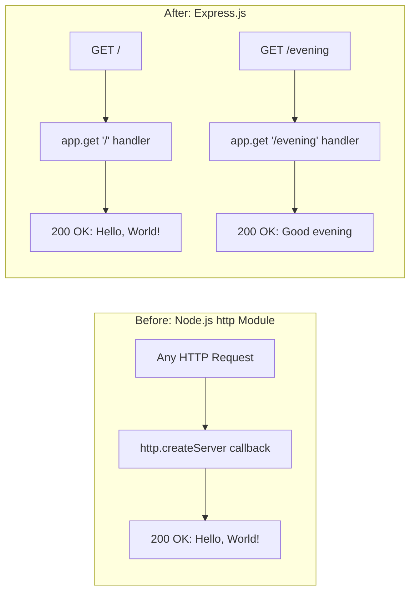

# Technical Specification

# 0. Agent Action Plan

## 0.1 Intent Clarification

### 0.1.1 Core Feature Objective

Based on the prompt, the Blitzy platform understands that the new feature requirement is to:

- **Introduce Express.js as the HTTP framework** — Replace the current bare Node.js `http` module implementation in `server.js` with Express.js, providing a modern, routing-capable HTTP framework for the project.
- **Preserve the existing "Hello, World!" endpoint** — The current server responds with `Hello, World!\n` to all incoming requests. This behavior must be preserved as a dedicated route (e.g., `GET /`) so that the existing functionality remains intact after the migration to Express.js.
- **Add a new "Good evening" endpoint** — Create an additional HTTP endpoint that returns the response `Good evening` when accessed. This requires Express.js route registration on a distinct path (e.g., `GET /evening`).
- **Maintain the server's operational characteristics** — The server should continue to listen on port `3000` and log its startup URL to the console, consistent with the current behavior defined in `server.js`.

Implicit requirements detected:

- The `package.json` must be updated to include `express` as a runtime dependency.
- The `package-lock.json` will be regenerated to reflect the new dependency tree.
- The `package.json` `main` field currently points to `index.js` (a non-existent file); this should be corrected to `server.js` to align with the actual application entry point.
- A `start` script should be added to `package.json` to provide a standard way to launch the server (`node server.js`).
- The `README.md` should be updated to document the new endpoint and setup instructions.

### 0.1.2 Special Instructions and Constraints

- **User Example:** "this is a tutorial of node js server hosting one endpoint that returns the response 'Hello world'. Could you add expressjs into the project and add another endpoint that return the response of 'Good evening'?"
- The user explicitly requests Express.js by name — no alternative frameworks (Koa, Fastify, Hapi) should be considered.
- The project currently uses the **CommonJS** module system (`require()` syntax, no `"type": "module"` in `package.json`). Express.js must be integrated using CommonJS imports to maintain consistency.
- The existing server binds to `127.0.0.1:3000`. Express defaults to binding on all interfaces (`0.0.0.0`). The implementation should preserve the hostname binding pattern for consistency, or adopt Express's default for broader accessibility per the tutorial nature of the project.
- No design system, UI framework, or Figma assets are applicable — this is a backend-only Node.js server modification.

### 0.1.3 Technical Interpretation

These feature requirements translate to the following technical implementation strategy:

- To **integrate Express.js**, we will install `express@5.2.1` as a runtime dependency via npm and refactor `server.js` to replace the `http.createServer()` pattern with Express's `express()` application factory and route-handler API.
- To **preserve the "Hello, World!" endpoint**, we will register a `GET /` route in Express that sends `Hello, World!\n` as a plain-text response, maintaining exact parity with the current response body, status code (`200`), and content type (`text/plain`).
- To **add the "Good evening" endpoint**, we will register a `GET /evening` route in Express that sends `Good evening` as a plain-text response.
- To **update project metadata**, we will modify `package.json` to add Express as a dependency, correct the `main` field to `server.js`, and add a `start` script.
- To **update documentation**, we will modify `README.md` to reflect the new project structure, available endpoints, and setup instructions.

## 0.2 Repository Scope Discovery

### 0.2.1 Comprehensive File Analysis

The repository is a flat, four-file Node.js project with zero subdirectories. Every file in the repository is directly affected by this feature addition.

**Existing Files Requiring Modification:**

| File | Current Purpose | Modification Required |
|---|---|---|
| `server.js` | HTTP server using Node.js built-in `http` module; serves static `Hello, World!\n` to all requests on `127.0.0.1:3000` | **Major rewrite** — Replace `http.createServer()` with Express.js application; add route definitions for `GET /` and `GET /evening` |
| `package.json` | npm package metadata; `hello_world@1.0.0`; zero dependencies; `main` points to non-existent `index.js` | **Modify** — Add `express` to `dependencies`; correct `main` field to `server.js`; add `start` script |
| `package-lock.json` | Dependency lockfile; currently empty dependency tree (lockfileVersion 3) | **Auto-regenerated** — Will be updated by `npm install express` to include Express and its transitive dependencies |
| `README.md` | Minimal documentation; heading `hao-backprop-test` with warning "Do not touch!" | **Modify** — Update to document Express.js integration, available endpoints, and setup/run instructions |

**Integration Point Discovery:**

- **API endpoints** — The current server has no route discrimination; all paths return the same response. Express.js will introduce explicit route matching:
  - `GET /` → Returns `Hello, World!\n` (preserving existing behavior)
  - `GET /evening` → Returns `Good evening` (new endpoint)
- **Server initialization** — The `server.listen()` call in `server.js` (lines 12–14) will be replaced with Express's `app.listen()` method.
- **Module imports** — The `require('http')` import (line 1) will be replaced with `require('express')`.

### 0.2.2 Web Search Research Conducted

- **Express.js latest stable version:** Confirmed Express.js v5.2.1 as the current latest stable release on npm, requiring Node.js >= 18. The installed Node.js v20.20.1 satisfies this requirement.
- **Express.js v5 key changes:** Express 5 dropped support for Node.js versions before v18, updated route matching to `path-to-regexp@8.x`, added native promise/async middleware support, and removed deprecated API methods from v3/v4.
- **CommonJS compatibility:** Express.js v5.x fully supports CommonJS `require()` imports, maintaining compatibility with the project's existing module system.

### 0.2.3 New File Requirements

Given the minimal, tutorial nature of this project, no new source files need to be created. All changes are contained within the existing four files:

- **No new source files** — The Express.js routes and server logic will be defined directly within the existing `server.js`, consistent with the project's deliberately simple, single-file architecture.
- **No new test files** — The project has no existing test infrastructure (the `test` script is a non-functional npm placeholder). Adding test files is outside the scope of this feature request, which focuses solely on Express.js integration and endpoint addition.
- **No new configuration files** — Express.js does not require separate configuration files for this use case. All settings (port, hostname) will remain inline in `server.js`.
- **No new directories** — The flat repository structure is maintained.

## 0.3 Dependency Inventory

### 0.3.1 Private and Public Packages

The project currently has zero dependencies. This feature introduces one new public npm package:

| Package Registry | Package Name | Version | Purpose | Status |
|---|---|---|---|---|
| npm (registry.npmjs.org) | `express` | `5.2.1` | HTTP framework providing routing, middleware, and request/response utilities for the Node.js server | To be added |

**Version Justification:**
- Express `5.2.1` is the latest stable release on npm, confirmed via `npm view express version`.
- Express 5.x requires `node >= 18` (confirmed via `npm view express engines`), and the project's Node.js v20.20.1 satisfies this constraint.
- No version is specified by the user, so the latest stable version is selected.

**Transitive Dependencies:**
- Express.js 5.x brings a set of well-maintained transitive dependencies (e.g., `accepts`, `body-parser`, `content-disposition`, `cookie`, `debug`, `depd`, `etag`, `finalhandler`, `fresh`, `merge-descriptors`, `methods`, `mime-types`, `on-finished`, `parseurl`, `qs`, `range-parser`, `router`, `send`, `serve-static`, `statuses`, `type-is`, `utils-merge`, `vary`). These will be automatically resolved and locked by `npm install`.

### 0.3.2 Dependency Updates

**Import Updates:**

The only file requiring import changes is `server.js`:

| File | Current Import | New Import |
|---|---|---|
| `server.js` | `const http = require('http');` | `const express = require('express');` |

The `http` module import is fully replaced — Express.js wraps the `http` module internally, so direct usage is no longer needed.

**External Reference Updates:**

| File | Update Required |
|---|---|
| `package.json` | Add `"express": "^5.2.1"` to a new `dependencies` object |
| `package-lock.json` | Auto-regenerated by `npm install` to capture full dependency tree |
| `README.md` | Update documentation to reference Express.js framework and installation instructions |

## 0.4 Integration Analysis

### 0.4.1 Existing Code Touchpoints

**Direct modifications required:**

- **`server.js`** (complete rewrite of lines 1–14):
  - **Line 1:** Replace `const http = require('http');` with `const express = require('express');`
  - **Lines 3–4:** The `hostname` and `port` constants may be retained for the `app.listen()` call, or the port can be passed directly.
  - **Lines 6–10:** Replace the `http.createServer()` callback with Express route definitions:
    - `app.get('/', ...)` for the existing `Hello, World!\n` response
    - `app.get('/evening', ...)` for the new `Good evening` response
  - **Lines 12–14:** Replace `server.listen(port, hostname, callback)` with `app.listen(port, callback)` — Express's `listen()` method delegates to Node's `http.Server.listen()` internally.

- **`package.json`** (metadata corrections and dependency addition):
  - Add `dependencies` block with `"express": "^5.2.1"`
  - Change `"main": "index.js"` to `"main": "server.js"` to resolve the existing discrepancy
  - Add `"start": "node server.js"` to the `scripts` block for standard npm startup

- **`README.md`** (documentation update):
  - Replace the existing content with updated project description, setup instructions, and endpoint documentation.

### 0.4.2 Dependency Injections

No dependency injection framework or container is used in this project. Express.js is imported as a module-level singleton and does not require service registration or wiring.

### 0.4.3 Database/Schema Updates

No database, schema, or migration changes are required. This project has no data persistence layer.

### 0.4.4 Integration Flow

The following diagram illustrates the before-and-after request handling flow:



## 0.5 Technical Implementation

### 0.5.1 File-by-File Execution Plan

Every file listed below MUST be modified as described. There are no new files to create — all changes are within the existing four-file structure.

**Group 1 — Core Application File:**

- **MODIFY: `server.js`** — Complete rewrite to replace Node.js `http` module with Express.js framework
  - Remove `require('http')` and replace with `require('express')`
  - Create Express application instance via `express()`
  - Register `GET /` route handler returning `Hello, World!\n` with `Content-Type: text/plain`
  - Register `GET /evening` route handler returning `Good evening` with `Content-Type: text/plain`
  - Start server with `app.listen()` on port `3000` with startup log message

**Group 2 — Project Metadata:**

- **MODIFY: `package.json`** — Add Express dependency and fix metadata
  - Add `"dependencies": { "express": "^5.2.1" }`
  - Change `"main": "index.js"` to `"main": "server.js"`
  - Add `"start": "node server.js"` to `scripts`
- **AUTO-UPDATE: `package-lock.json`** — Regenerated by `npm install express`

**Group 3 — Documentation:**

- **MODIFY: `README.md`** — Document Express.js integration and endpoints
  - Update project description to reflect Express.js usage
  - Add setup instructions (`npm install`)
  - Document available endpoints: `GET /` and `GET /evening`
  - Add run instructions (`npm start` or `node server.js`)

### 0.5.2 Implementation Approach per File

**`server.js` — Express.js Migration:**

The refactored `server.js` will follow this structure:

```javascript
const express = require('express');
const app = express();
```

- Two route handlers will be registered using `app.get()` for `GET /` and `GET /evening`.
- The server will be started using `app.listen(3000, callback)` with a console log confirming the server URL.
- The response for `GET /` will use `res.type('text/plain').send('Hello, World!\n')` to maintain exact parity with the current response.
- The response for `GET /evening` will use `res.type('text/plain').send('Good evening')` as specified by the user.

**`package.json` — Dependency and Metadata Update:**

- The `dependencies` field is currently absent and will be added with the Express entry.
- The `main` field correction from `index.js` to `server.js` resolves a known discrepancy documented in the existing tech spec (Section 2.1.5).
- The `start` script addition provides a standard npm-compatible way to launch the server.

**`README.md` — Documentation Refresh:**

- The documentation will be updated to reflect the new Express.js-powered server with two endpoints, including setup and usage instructions appropriate for a tutorial-style project.

### 0.5.3 User Interface Design

Not applicable — this project is a backend-only Node.js HTTP server with no user interface, frontend assets, or visual components. All interactions occur via HTTP requests/responses to the API endpoints.

## 0.6 Scope Boundaries

### 0.6.1 Exhaustively In Scope

All modifications are contained within the existing repository root directory. No new directories or wildcard patterns apply given the flat, four-file structure.

**Application source:**
- `server.js` — Complete rewrite: replace `http` module with Express.js; add `GET /` and `GET /evening` route handlers; update server startup

**Project metadata:**
- `package.json` — Add `express@^5.2.1` dependency; correct `main` field to `server.js`; add `start` script
- `package-lock.json` — Auto-regenerated by `npm install` to reflect Express.js and its transitive dependencies

**Documentation:**
- `README.md` — Update project description, setup instructions, and endpoint documentation

**Verification criteria:**
- `npm install` completes without errors and installs Express.js 5.2.1
- `node server.js` starts the server successfully on port 3000
- `GET http://127.0.0.1:3000/` returns HTTP 200 with body `Hello, World!\n`
- `GET http://127.0.0.1:3000/evening` returns HTTP 200 with body `Good evening`

### 0.6.2 Explicitly Out of Scope

- **Test infrastructure** — No test files, test frameworks (Jest, Mocha, Vitest), or test scripts will be added. The existing non-functional `test` script placeholder is not modified beyond what is necessary.
- **Middleware additions** — No additional Express middleware (e.g., `cors`, `helmet`, `body-parser`, `morgan`) will be introduced. Only Express's built-in routing is used.
- **HTTPS/TLS support** — No SSL certificate configuration or HTTPS server creation.
- **Environment variable configuration** — No `.env` files, `dotenv` package, or environment-based port/host configuration.
- **Docker or containerization** — No `Dockerfile`, `docker-compose.yml`, or container configuration.
- **CI/CD pipelines** — No GitHub Actions, GitLab CI, or other pipeline configurations.
- **TypeScript migration** — The project remains in JavaScript with CommonJS module syntax.
- **Linting or formatting** — No ESLint, Prettier, or other code quality tooling.
- **Additional endpoints** — Only the two endpoints specified by the user (`GET /` and `GET /evening`) will be implemented. No catch-all, 404 handler, or other routes.
- **Performance optimizations** — No clustering, compression middleware, or caching headers.
- **Refactoring of unrelated code** — No changes beyond what is needed for Express.js integration and the new endpoint.

## 0.7 Rules for Feature Addition

### 0.7.1 Feature-Specific Rules and Requirements

The following rules are derived from the user's instructions and the project's established conventions:

- **Use Express.js explicitly** — The user specifically requested Express.js. No alternative HTTP frameworks (Koa, Fastify, Hapi, Nest.js) are acceptable substitutes.
- **Preserve existing response behavior** — The `Hello, World!\n` response on `GET /` must be byte-identical to the current response: HTTP status `200`, `Content-Type: text/plain`, body `Hello, World!\n` (14 bytes including trailing newline).
- **Maintain CommonJS module system** — The project uses `require()` syntax without `"type": "module"` in `package.json`. All new code must use `require()` / `module.exports` patterns, not ES module `import`/`export` syntax.
- **Keep the single-file architecture** — The project is a tutorial-style, minimal Node.js server. All application logic remains in `server.js` — do not split into multiple source files, routers, or modules.
- **Maintain port 3000** — The server must continue to listen on port `3000` to preserve behavioral consistency.
- **Console startup log** — The server must log its URL to the console upon successful startup, consistent with the existing `console.log` in the `server.listen()` callback.

### 0.7.2 User-Specified Implementation Rules

The user provided two named rule sets for this project:

- **Rule: `QA-19-march-rules`** — No content specified (empty rule set).
- **Rule: `QA-Rules-23-March-add-features`** — Restates the user's original request: "this is a tutorial of node js server hosting one endpoint that returns the response 'Hello world'. Could you add expressjs into the project and add another endpoint that return the response of 'Good evening'?"

These rules confirm the feature scope with no additional constraints beyond the core request.

## 0.8 References

### 0.8.1 Repository Files and Folders Searched

All four files in the repository were retrieved and analyzed in full:

| File Path | Lines | Purpose | Analysis Outcome |
|---|---|---|---|
| `server.js` | 14 | HTTP server using Node.js `http` module; serves `Hello, World!\n` on `127.0.0.1:3000` | Primary modification target — complete rewrite to Express.js |
| `package.json` | 11 | npm package metadata (`hello_world@1.0.0`); zero dependencies; `main` points to non-existent `index.js` | Modify to add Express dependency, fix `main` field, add `start` script |
| `package-lock.json` | 13 | Dependency lockfile (lockfileVersion 3); empty dependency tree | Auto-regenerated by `npm install express` |
| `README.md` | 2 | Project identity (`hao-backprop-test`) and warning directive | Update with Express.js documentation and endpoint details |

The repository root folder was explored via `get_source_folder_contents` — no subdirectories exist. The `.git` directory was identified but is not in scope.

### 0.8.2 Technical Specification Sections Referenced

| Section | Key Information Retrieved |
|---|---|
| 1.1 Executive Summary | Project purpose as a minimal Backprop test fixture; value inversely proportional to complexity |
| 1.3 Scope | In-scope features (static HTTP response, startup logging) and comprehensive out-of-scope exclusions |
| 2.1 Feature Catalog | Four existing features (F-001 through F-004); feature metadata and dependency documentation |
| 2.2 Functional Requirements | Detailed requirements for HTTP response serving, startup notification, and NPM structure |
| 3.1 Programming Languages | JavaScript ES6+ with CommonJS module system; no `.nvmrc` or `engines` constraints |
| Node.js Runtime | Node.js 15+ minimum (inferred from lockfileVersion 3); current runtime v20.20.1 |
| 3.2 Frameworks & Libraries | Confirmed zero frameworks; justification for zero-framework architecture |
| 3.3 Open Source Dependencies | Confirmed zero npm dependencies; empty dependency tree in lockfile |
| 5.1 High-Level Architecture | Monolithic single-file architecture; stateless request-response pattern; hardcoded configuration |
| 6.1 Core Services Architecture | Not applicable assessment; single-process design; no service boundaries |

### 0.8.3 External Research Conducted

| Search Query | Key Finding | Source |
|---|---|---|
| Express.js latest stable version 2026 | Express.js v5.2.1 is the latest stable release; requires Node.js >= 18 | npm registry (`npmjs.com/package/express`) |
| Express.js v5 release details | Express 5 dropped Node.js < 18, updated `path-to-regexp@8.x`, added async middleware support | GitHub (`github.com/expressjs/express/releases`) |

### 0.8.4 Attachments and External Assets

- **Attachments:** No file attachments were provided with this project.
- **Figma URLs:** No Figma designs were provided or referenced — this is a backend-only server project.
- **Environment files:** No environment-specific files were provided in `/tmp/environments_files/`.
- **Environment variables:** No environment variables were specified by the user.
- **Secrets:** No secrets were specified by the user.

