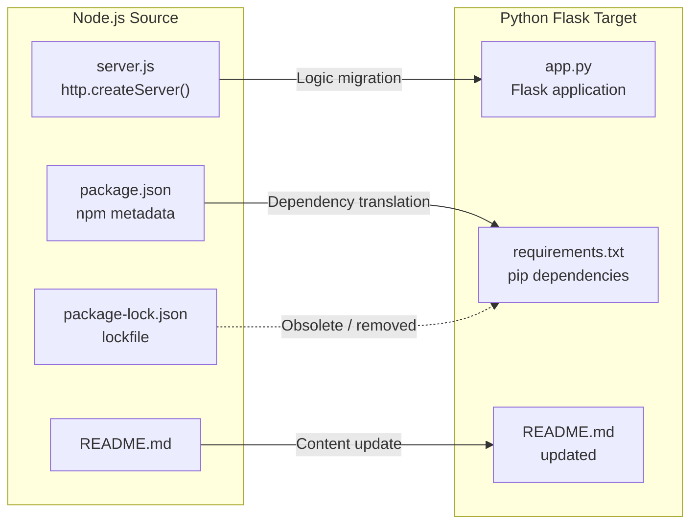

# Technical Specification

# 0. Agent Action Plan

## 0.1 Intent Clarification

### 0.1.1 Core Refactoring Objective

Based on the prompt, the Blitzy platform understands that the refactoring objective is to perform a **complete tech stack migration** of an existing Node.js HTTP server into a functionally equivalent Python 3 Flask application. The user has explicitly required that every feature and functionality must be preserved exactly as in the original Node.js project, and the rewritten version must fully match the behavior and logic of the current implementation.

- **Refactoring type:** Tech stack migration (Node.js → Python 3 Flask)
- **Target repository:** Same repository — the Python Flask application replaces the Node.js implementation in-place
- **Behavioral fidelity requirement:** The rewritten Flask server must produce identical HTTP responses, bind to the same network interface and port, and emit equivalent startup logging as the original Node.js `server.js`

**Refactoring Goals with Enhanced Clarity:**

- **Goal 1 — HTTP Response Parity:** The Flask application must respond to every inbound HTTP request — regardless of method, path, headers, or payload — with an HTTP 200 OK status, a `Content-Type: text/plain` header, and the exact body `"Hello, World!\n"`. This corresponds to Feature F-001 (HTTP Response Service) as implemented in `server.js` lines 6–9.
- **Goal 2 — Network Binding Parity:** The Flask application must bind exclusively to the loopback address `127.0.0.1` on port `3000`, matching the hardcoded constants in `server.js` lines 3–4. This preserves Feature F-002 (Localhost Network Binding).
- **Goal 3 — Startup Logging Parity:** Upon successful startup, the Flask application must emit a console message indicating the server URL (`http://127.0.0.1:3000/`), preserving the behavior of Feature F-003 (Startup Console Logging) from `server.js` lines 12–14.
- **Goal 4 — Dependency Management Translation:** The npm package metadata in `package.json` must be translated to Python-equivalent dependency management using `requirements.txt`, documenting Flask and its version as the sole external dependency.
- **Goal 5 — Documentation Continuity:** The `README.md` must be updated to reflect the new Python Flask implementation while preserving the repository's identity and purpose context.

**Implicit Requirements Surfaced:**

- The Flask application must use a catch-all route to replicate Node.js `http.createServer()`'s behavior of handling all paths and methods identically
- The response body must include the trailing newline character (`\n`) to match the exact Node.js output
- The server must run directly via `python app.py` without requiring the `flask run` CLI command, mirroring the `node server.js` execution model
- All Node.js-specific files (`package.json`, `package-lock.json`) become obsolete and must be replaced with Python equivalents

### 0.1.2 Technical Interpretation

This refactoring translates to the following technical transformation strategy:

**Source Architecture (Node.js):**
- Runtime: Node.js (any version supporting CommonJS and the `http` built-in module)
- Language: JavaScript ES6+ with CommonJS module system
- Server: Built-in `http.createServer()` — no framework
- Dependencies: Zero external packages
- Configuration: Hardcoded constants in source code

**Target Architecture (Python 3 Flask):**
- Runtime: Python 3.12
- Language: Python 3
- Server: Flask 3.1.3 WSGI micro-framework with Werkzeug development server
- Dependencies: Flask 3.1.3 (with transitive dependencies: Werkzeug, Jinja2, MarkupSafe, ItsDangerous, Click, Blinker)
- Configuration: Hardcoded constants in source code (preserving determinism)

**Transformation Rules:**

| Node.js Concept | Python Flask Equivalent | Notes |
|---|---|---|
| `require('http')` | `from flask import Flask` | Framework import replaces built-in module |
| `http.createServer(callback)` | `app = Flask(__name__)` | Flask app instance replaces server factory |
| `res.statusCode = 200` | Return tuple with status code `200` | Flask response tuple pattern |
| `res.setHeader('Content-Type', 'text/plain')` | Response object with `content_type='text/plain'` | Flask Response or `make_response` |
| `res.end('Hello, World!\n')` | `return Response('Hello, World!\n', ...)` | Flask Response return |
| `server.listen(port, hostname, cb)` | `app.run(host='127.0.0.1', port=3000)` | Flask development server binding |
| `console.log(...)` | `print(...)` or Flask startup banner | Python stdout for logging |
| `const hostname / port` | Python constants `HOSTNAME` / `PORT` | PEP 8 constant naming convention |
| `package.json` | `requirements.txt` | Dependency manifest translation |
| `package-lock.json` | Not needed (pip handles resolution) | Lockfile not required for minimal project |

**Architectural Mapping Diagram:**




## 0.2 Source Analysis

### 0.2.1 Comprehensive Source File Discovery

The repository follows a flat, single-directory structure with zero subdirectories. Every file resides at the repository root. The complete source tree is:

```
Current:
├── server.js           (14 lines — sole runtime component, HTTP server)
├── package.json        (11 lines — npm package manifest, zero dependencies)
├── package-lock.json   (13 lines — npm lockfile confirming zero dependencies)
└── README.md           (2 lines — repository identity and stability directive)
```

**Total files: 4 | Total directories: 0 | Total lines of code: 40**

### 0.2.2 Source File Inventory

**File: `server.js` (14 lines) — Primary migration target**

| Attribute | Detail |
|---|---|
| Path | `server.js` |
| Type | JavaScript (ES6+, CommonJS) |
| Lines | 14 |
| Role | Sole runtime component — HTTP server implementation |
| Imports | `http` (Node.js built-in module) |
| Exports | None |
| Constants | `hostname = '127.0.0.1'`, `port = 3000` |
| Functions | Anonymous callback in `http.createServer()` |
| Features Implemented | F-001 (HTTP Response Service), F-002 (Localhost Network Binding), F-003 (Startup Console Logging) |

Key behaviors to preserve during migration:
- Responds to ALL HTTP methods (GET, POST, PUT, DELETE, PATCH, OPTIONS, HEAD, etc.) on ALL paths with an identical response
- The `req` object is completely ignored — no method, path, header, query parameter, or body inspection occurs
- Response: status `200`, header `Content-Type: text/plain`, body `"Hello, World!\n"`
- Binds to `127.0.0.1:3000` (loopback only, no remote access)
- Logs `Server running at http://127.0.0.1:3000/` to stdout upon successful bind

**File: `package.json` (11 lines) — Dependency manifest to be replaced**

| Attribute | Detail |
|---|---|
| Path | `package.json` |
| Type | JSON |
| Lines | 11 |
| Role | npm package identity and metadata |
| Package Name | `hello_world` |
| Version | `1.0.0` |
| Author | `hxu` |
| License | MIT |
| Dependencies | None (field absent) |
| devDependencies | None (field absent) |
| Entry Point | `index.js` (declared but file does not exist — known inconsistency) |

This file will be replaced by `requirements.txt` in the Python project.

**File: `package-lock.json` (13 lines) — Lockfile to be removed**

| Attribute | Detail |
|---|---|
| Path | `package-lock.json` |
| Type | JSON |
| Lines | 13 |
| Role | npm lockfile confirming zero third-party dependencies |
| lockfileVersion | 3 (npm v9+) |
| Packages | Root entry only — empty dependency tree |

This file has no Python equivalent in a minimal project and will be removed.

**File: `README.md` (2 lines) — Documentation to be updated**

| Attribute | Detail |
|---|---|
| Path | `README.md` |
| Type | Markdown |
| Lines | 2 |
| Role | Repository identity (`hao-backprop-test`) and purpose statement |
| Content | Title: `hao-backprop-test`, Body: `test project for backprop integration. Do not touch!` |

This file will be updated to reflect the Python Flask implementation.

### 0.2.3 Complete Source File Listing

| # | File | Lines | Purpose | Migration Action |
|---|---|---|---|---|
| 1 | `server.js` | 14 | HTTP server implementation | Rewrite as `app.py` using Flask |
| 2 | `package.json` | 11 | npm metadata and dependency manifest | Replace with `requirements.txt` |
| 3 | `package-lock.json` | 13 | npm dependency lockfile | Remove (no Python equivalent needed) |
| 4 | `README.md` | 2 | Repository documentation | Update for Python Flask project |

No additional files, hidden files, or subdirectories exist in the repository. Discovery is complete with zero files remaining to be identified.


## 0.3 Scope Boundaries

### 0.3.1 Exhaustively In Scope

**Source Transformations:**
- `server.js` — Complete rewrite from Node.js JavaScript to Python Flask (`app.py`)
- `package.json` — Replace with Python dependency manifest (`requirements.txt`)
- `package-lock.json` — Remove entirely (npm-specific artifact with no equivalent needed)

**New File Creation:**
- `app.py` — Flask application implementing all features from `server.js`
- `requirements.txt` — Python dependency file declaring Flask==3.1.3

**Documentation Updates:**
- `README.md` — Update to reflect the Python Flask implementation, updated run commands, and dependency instructions

**Behavioral Parity Requirements (all features from Feature Catalog):**
- F-001 (HTTP Response Service): Catch-all route returning `200 OK`, `text/plain`, `"Hello, World!\n"`
- F-002 (Localhost Network Binding): Flask `app.run(host='127.0.0.1', port=3000)`
- F-003 (Startup Console Logging): Print server URL on startup to stdout
- F-004 (Package Identity & Metadata): Translated to Python `requirements.txt`
- F-005 (Stability Contract): README preserved with updated technical context

**Import and Dependency Translation:**
- `require('http')` → `from flask import Flask, Response`
- npm ecosystem → pip ecosystem
- `node server.js` execution → `python app.py` execution

### 0.3.2 Explicitly Out of Scope

The following items are explicitly excluded from this refactoring effort, consistent with the original project's intentional design constraints:

| Excluded Item | Rationale |
|---|---|
| URL routing and path handling | Original server ignores all paths; Flask catch-all preserves this |
| Request body parsing | Original server never reads `req`; no parsing needed in Flask |
| Authentication and authorization | Not present in original; not added in migration |
| Database connections and persistence | Original is fully stateless; no data layer in Flask |
| Error handling middleware | Original has no custom error handling; Flask defaults suffice |
| Structured logging framework | Original uses single `console.log`; Python `print()` suffices |
| Environment variable configuration | Original uses hardcoded constants; preserved in Flask |
| Automated test suites | Original has no tests (placeholder `npm test` only); not added |
| CI/CD pipelines | Not present in original; not introduced in migration |
| Docker containerization | Not present in original; not introduced in migration |
| Production deployment configuration | Original is a test fixture, not a production service |
| WSGI production server (Gunicorn, uWSGI) | Development server is sufficient for the test fixture role |
| Type hints or mypy configuration | Not required for behavioral parity |
| Virtual environment setup files | User manages their own environment |
| `pyproject.toml` or `setup.py` | Minimal project does not require package build configuration |


## 0.4 Target Design

### 0.4.1 Refactored Structure Planning

The target structure maintains the flat, minimal architecture of the original repository while replacing Node.js artifacts with Python equivalents. Every file necessary for standalone operation is listed explicitly.

```
Target:
├── app.py              (Flask server — replaces server.js)
├── requirements.txt    (Python dependencies — replaces package.json)
└── README.md           (Updated documentation — preserves repository identity)
```

**Target File Descriptions:**

| File | Lines (est.) | Purpose | Standalone Requirement |
|---|---|---|---|
| `app.py` | ~20 | Flask HTTP server with catch-all route, localhost binding on port 3000, startup logging | Core application — must be executable via `python app.py` |
| `requirements.txt` | ~1 | Declares `Flask==3.1.3` as the sole direct dependency | Dependency management — enables `pip install -r requirements.txt` |
| `README.md` | ~10 | Updated repository documentation with Python-specific instructions | Human-facing documentation and repository identity |

**Files Removed from Source:**

| File Removed | Reason |
|---|---|
| `server.js` | Replaced by `app.py` |
| `package.json` | Node.js-specific; replaced by `requirements.txt` |
| `package-lock.json` | Node.js-specific; no Python equivalent required |

### 0.4.2 Web Search Research Conducted

- **Flask latest stable version:** Flask 3.1.3 (released February 19, 2026) confirmed as the current production-stable release via PyPI. Flask supports Python 3.9 and newer.
- **Flask catch-all route pattern:** Flask supports catch-all routes using `@app.route('/', defaults={'path': ''})` combined with `@app.route('/<path:path>')` to match all URL paths, replicating the Node.js `http.createServer()` behavior of handling every request identically.
- **Flask development server:** `app.run(host, port)` launches Werkzeug's development server, analogous to Node.js `server.listen(port, hostname)`.
- **Flask method handling:** The `methods` parameter on `@app.route()` accepts a list of HTTP methods. Using `methods=['GET', 'POST', 'PUT', 'DELETE', 'PATCH', 'OPTIONS', 'HEAD']` ensures all standard methods are handled by the same route.

### 0.4.3 Design Pattern Applications

Given the extreme simplicity of this application, the following minimal design patterns apply:

- **Single-module pattern:** The entire application resides in a single `app.py` file, mirroring the original single-file `server.js` architecture. No module decomposition is warranted.
- **Catch-all route pattern:** A Flask catch-all route with explicit multi-method support replaces the Node.js `http.createServer()` universal handler. This preserves the behavior where every request — regardless of method, path, or content — receives the same response.
- **Direct execution pattern:** The `if __name__ == '__main__':` guard enables direct script execution via `python app.py`, paralleling the `node server.js` entry point. This avoids dependency on the `flask run` CLI command.
- **Hardcoded configuration pattern:** All network binding parameters (host, port) remain as module-level constants, preserving the deterministic configuration approach from the original Node.js implementation.

### 0.4.4 Target Application Blueprint

The Flask application in `app.py` follows this logical structure:

```python
from flask import Flask, Response
app = Flask(__name__)
# Catch-all route + app.run(...)

```

**Key design decisions:**
- `Flask.Response` is used directly to set exact status code, content type, and body — ensuring byte-for-byte response parity with the Node.js original
- The catch-all route handles both the root path (`/`) and all sub-paths (`/<path:path>`) within a single handler function
- All standard HTTP methods are explicitly listed to prevent Flask's default of GET-only routing
- The `print()` statement before `app.run()` replicates the Node.js startup log behavior, and Flask's own startup banner is suppressed to avoid duplicate output


## 0.5 Transformation Mapping

### 0.5.1 File-by-File Transformation Plan

The following table maps every target file to its corresponding source, transformation mode, and key changes required:

| Target File | Transformation | Source File | Key Changes |
|---|---|---|---|
| `app.py` | CREATE | `server.js` | Rewrite Node.js HTTP server as Flask application: replace `require('http')` with Flask imports, replace `http.createServer()` callback with `@app.route()` catch-all handler, replace `server.listen()` with `app.run(host='127.0.0.1', port=3000)`, replace `console.log()` with `print()`, preserve exact response: status 200, Content-Type text/plain, body "Hello, World!\n" |
| `requirements.txt` | CREATE | `package.json` | Translate npm package metadata into Python dependency file: declare `Flask==3.1.3` as the sole direct dependency. No other dependencies required. |
| `README.md` | UPDATE | `README.md` | Update documentation to reflect Python Flask implementation: change run command from `node server.js` to `python app.py`, add `pip install -r requirements.txt` setup step, preserve repository identity as `hao-backprop-test` and backprop integration context |

**Files to be Removed (Node.js artifacts superseded by Python equivalents):**

| File Removed | Replaced By | Reason |
|---|---|---|
| `server.js` | `app.py` | Server logic fully migrated to Flask |
| `package.json` | `requirements.txt` | npm manifest replaced by pip dependency file |
| `package-lock.json` | *(none needed)* | npm lockfile has no equivalent in this minimal Python project |

### 0.5.2 Cross-File Dependencies

**Import Statement Transformations:**

The original project has exactly one import statement. The transformation is:

| Context | Original (Node.js) | Target (Python Flask) |
|---|---|---|
| Server framework import | `const http = require('http');` | `from flask import Flask, Response` |

**Execution Command Transformation:**

| Context | Original | Target |
|---|---|---|
| Server startup | `node server.js` | `python app.py` |
| Dependency install | `npm install` | `pip install -r requirements.txt` |
| Test command | `npm test` (placeholder, exits with error) | *(no test infrastructure — out of scope)* |

**Configuration Constant Transformations:**

| Constant | Node.js (`server.js`) | Python (`app.py`) |
|---|---|---|
| Hostname | `const hostname = '127.0.0.1';` | `HOSTNAME = '127.0.0.1'` |
| Port | `const port = 3000;` | `PORT = 3000` |

**Response Construction Transformations:**

| Step | Node.js (`server.js`) | Python (`app.py`) |
|---|---|---|
| Status code | `res.statusCode = 200;` | Included in `Response(..., status=200)` |
| Content-Type header | `res.setHeader('Content-Type', 'text/plain');` | Included in `Response(..., content_type='text/plain')` |
| Response body | `res.end('Hello, World!\n');` | `Response('Hello, World!\n', ...)` |

**Startup Logging Transformation:**

| Node.js (`server.js`) | Python (`app.py`) |
|---|---|
| `` console.log(`Server running at http://${hostname}:${port}/`) `` | `print(f'Server running at http://{HOSTNAME}:{PORT}/')` |

### 0.5.3 Wildcard Patterns

Due to the flat, minimal structure of this project (4 source files, 0 subdirectories), no wildcard patterns are necessary. Every file is individually mapped in the transformation plan above.

### 0.5.4 One-Phase Execution

The entire refactor is executed by Blitzy in **one single phase**. All file creations, updates, and removals occur atomically:

- CREATE `app.py` (from `server.js` logic)
- CREATE `requirements.txt` (from `package.json` dependency context)
- UPDATE `README.md` (preserve identity, update technical instructions)
- REMOVE `server.js` (superseded by `app.py`)
- REMOVE `package.json` (superseded by `requirements.txt`)
- REMOVE `package-lock.json` (no longer applicable)


## 0.6 Dependency Inventory

### 0.6.1 Key Private and Public Packages

The original Node.js project declares **zero external dependencies** — both the `dependencies` and `devDependencies` fields are absent from `package.json`, and `package-lock.json` confirms an empty packages map.

The target Python Flask project introduces **one direct dependency** (Flask) which brings five transitive dependencies:

| Package Registry | Package Name | Version | Purpose | Status |
|---|---|---|---|---|
| PyPI | Flask | 3.1.3 | WSGI micro-framework — replaces Node.js built-in `http` module as the HTTP server foundation | New (to be added) |
| PyPI | Werkzeug | 3.1.8 | WSGI toolkit — provides the development server, request/response objects, and HTTP utilities (auto-installed with Flask) | Transitive dependency |
| PyPI | Jinja2 | 3.1.6 | Template engine (auto-installed with Flask, not actively used in this application) | Transitive dependency |
| PyPI | MarkupSafe | 3.0.3 | Safe string markup (auto-installed with Jinja2) | Transitive dependency |
| PyPI | ItsDangerous | 2.2.0 | Data signing for session cookies (auto-installed with Flask, not actively used) | Transitive dependency |
| PyPI | Click | 8.3.1 | CLI framework for Flask commands (auto-installed with Flask) | Transitive dependency |
| PyPI | Blinker | 1.9.0 | Signal support (auto-installed with Flask) | Transitive dependency |

**Note:** Only `Flask==3.1.3` is declared in `requirements.txt`. All transitive dependencies are resolved automatically by pip during installation. The version numbers above were verified by installing Flask 3.1.3 in the target environment.

### 0.6.2 Dependency Updates

**Source Dependencies Removed:**

| Ecosystem | Artifact | Action |
|---|---|---|
| npm | `package.json` | Remove — no longer applicable in Python project |
| npm | `package-lock.json` | Remove — no longer applicable in Python project |
| Node.js | Built-in `http` module | No longer used — replaced by Flask |

**Target Dependencies Added:**

| Ecosystem | Artifact | Content |
|---|---|---|
| pip | `requirements.txt` | `Flask==3.1.3` |

### 0.6.3 Import Refactoring

**Files requiring import updates:**

Since the project has exactly one source file with imports (`server.js` → `app.py`), the import refactoring is a single transformation:

| File | Original Import (Node.js) | Target Import (Python) |
|---|---|---|
| `server.js` → `app.py` | `const http = require('http');` | `from flask import Flask, Response` |

No other files in the repository contain import statements. No wildcard patterns are applicable.

### 0.6.4 External Reference Updates

| File Type | File | Update Required |
|---|---|---|
| Documentation | `README.md` | Update run commands from `node server.js` to `python app.py`, add `pip install -r requirements.txt` |
| Dependency manifest | `requirements.txt` (new) | Create with `Flask==3.1.3` |
| Build/config files | `package.json` (removed) | No update — file is deleted |
| Lockfile | `package-lock.json` (removed) | No update — file is deleted |


## 0.7 Refactoring Rules

### 0.7.1 Behavioral Parity Rules

The following rules govern the refactoring to ensure the Python Flask application is a functionally identical replacement for the Node.js server:

- **Rule 1 — Response Identity:** The Flask application must return the exact same HTTP response for every request: status `200`, header `Content-Type: text/plain`, body `"Hello, World!\n"` (including trailing newline). No variation in response is permitted.
- **Rule 2 — Universal Request Handling:** The Flask application must handle ALL HTTP methods (GET, POST, PUT, DELETE, PATCH, OPTIONS, HEAD) on ALL URL paths identically, mirroring the Node.js `http.createServer()` behavior where the `req` object is completely ignored.
- **Rule 3 — Network Binding Fidelity:** The Flask application must bind exclusively to `127.0.0.1` on port `3000`. No other host or port is acceptable.
- **Rule 4 — Startup Signal:** The Flask application must print a startup message to stdout indicating the server URL, equivalent to the original `Server running at http://127.0.0.1:3000/` message.
- **Rule 5 — Stateless Operation:** The Flask application must maintain zero state between requests — no session data, no in-memory caches, no file writes, no database connections.
- **Rule 6 — Direct Execution:** The Flask application must be runnable via `python app.py` without requiring the `flask run` CLI, Docker, or any other orchestration tool.

### 0.7.2 Special Instructions and Constraints

- **Hardcoded configuration preserved:** All server parameters (hostname, port, response body, status code, content type) must remain hardcoded constants in the source code. No environment variables, configuration files, or CLI arguments are introduced. This preserves the deterministic design of the original test fixture.
- **Minimal dependency footprint:** Only Flask is declared as a direct dependency. No additional packages (e.g., Gunicorn, python-dotenv, logging libraries) are introduced.
- **No feature additions:** The refactoring is strictly a technology migration. No new routes, middleware, error handlers, health checks, or features are added beyond what exists in the original Node.js implementation.
- **README preservation:** The `README.md` must preserve the repository name (`hao-backprop-test`), purpose statement (backprop integration test), and contextual identity while updating technical instructions for Python.

### 0.7.3 User-Specified Implementation Rules

The user has specified the following implementation rule:

- **Rule name:** QA-03-Apr-rules
- **Rule content:** `npm create`


## 0.8 References

### 0.8.1 Codebase Files and Folders Searched

The following files and folders were systematically searched and analyzed to derive all conclusions in this Agent Action Plan:

| Path | Type | Purpose of Inspection |
|---|---|---|
| `` (repository root) | Folder | Discovered complete project structure: 4 files, 0 subdirectories |
| `server.js` | File | Analyzed complete HTTP server implementation (14 lines): request handler, network binding, startup logging, response construction |
| `package.json` | File | Extracted package identity (`hello_world@1.0.0`), author (`hxu`), license (MIT), confirmed zero dependencies, noted `main: index.js` inconsistency |
| `package-lock.json` | File | Confirmed lockfileVersion 3, verified empty packages map (zero third-party dependencies) |
| `README.md` | File | Retrieved repository identity (`hao-backprop-test`), purpose statement (backprop integration test), stability directive ("Do not touch!") |

### 0.8.2 Technical Specification Sections Referenced

| Section | Content Used |
|---|---|
| 1.1 Executive Summary | Project overview, stakeholders, value proposition |
| 1.3 Scope | In-scope features, out-of-scope exclusions, implementation boundaries |
| 2.1 Feature Catalog | Feature inventory (F-001 through F-005) with detailed metadata and dependencies |
| 3.1 Technology Stack Overview | Design philosophy (radical minimalism), complete stack summary, architecture diagram |
| 3.4 Open Source Dependencies | Dependency manifest analysis, zero-dependency design rationale |
| 4.4 HTTP Request-Response Handling | Request processing flow, response construction pipeline, business rules |
| 5.1 High-Level Architecture | System overview, core components, data flow, external integration points |
| 5.2 Component Details | HTTP server component, package manifest, dependency lockfile, documentation component |

### 0.8.3 External Research Conducted

| Search Topic | Source | Key Finding |
|---|---|---|
| Flask latest stable version | PyPI (https://pypi.org/project/Flask/) | Flask 3.1.3 released February 19, 2026; supports Python 3.9+ |
| Flask installation and dependencies | Flask Documentation (https://flask.palletsprojects.com/en/stable/installation/) | Flask auto-installs Werkzeug, Jinja2, MarkupSafe, ItsDangerous, Click, Blinker |
| Flask version history | GitHub Releases (https://github.com/pallets/flask/releases) | Flask 3.1.x series is current stable line; 3.1.0 dropped Python 3.8 support |

### 0.8.4 Environment Verification

| Check | Result |
|---|---|
| Node.js server execution (`node server.js`) | Confirmed: server starts on 127.0.0.1:3000, responds with `Hello, World!` (200 OK, text/plain) |
| Flask installation (`pip install Flask==3.1.3`) | Confirmed: Flask 3.1.3 installed with all transitive dependencies (Werkzeug 3.1.8, Jinja2 3.1.6, MarkupSafe 3.0.3, ItsDangerous 2.2.0, Click 8.3.1, Blinker 1.9.0) |
| Python runtime | Python 3.12.3 |
| Node.js runtime | Node.js v20.20.2, npm 11.1.0 |

### 0.8.5 Attachments

No attachments were provided for this project. No Figma URLs or external design assets are referenced.


